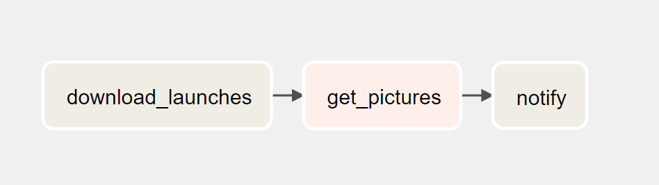
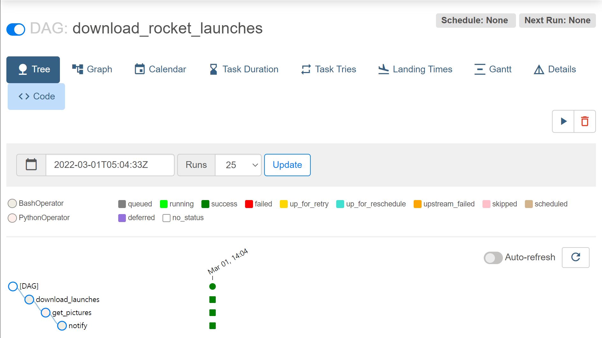
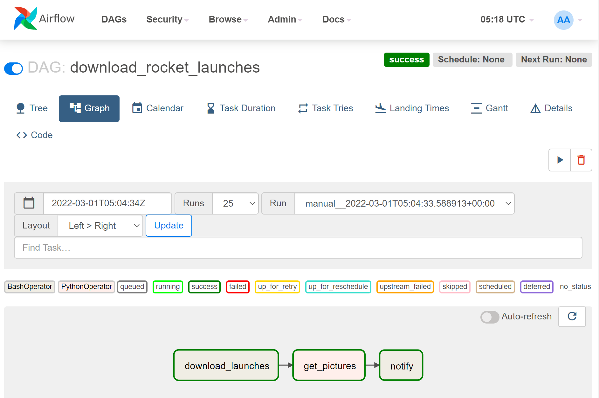

# Chapter 02: Anatomy of an Airflow DAG

## Key Points:
* Airflow에서 DAG와 Operator (Task)를 이용해 워크플로우를 정의하는 방법
* Airflow UI에서 DAG를 실행하고 Task를 관리하는 것에 대한 간단한 개요

## Our first Airflow DAG
Scenario:
* 철수는 로켓 발사에 매우 관심이 많아서 전세계에서 일어나는 모든 발사들에 대한 정보를 트래킹하고싶다.
* 일단 첫 시도로 로켓들의 이미지를 수집하기로 했다!

### Workflow to collect rocket images
로켓 데이터는 [Launch Library 2](https://thespacedevs.com/llapi)에서 제공하는 open API를 이용해 받아올 수 있다.
철수는 upcoming rocket launch에 관심이 있고, 해당 API는 [여기](https://ll.thespacedevs.com/2.0.0/launch/upcoming)에서 제공된다.
`curl`을 이용해서 JSON response를 받아보면, 철수가 원하는 로켓 이미지들의 URL이 적힌 데이터를 볼 수 있다 (자세한 데이터 형식은 페이지 21 참조).
이 URL을 이용해서 이미지를 다운로드하고 수집할 수 있게 된다.

전체적인 워크플로우는 아래와 같다:
```
1. Fetch & download upcoming launch data.
2. Fetch & download rocket images based on the URLs listed in the launch data.
3. Notify.
```

Airflow에서는 위와 같은 워크플로우를 DAG로 표현해야 하고, 이를 수행할 수 있게해준다.
### Defining a DAG
* DAG는 여러개의 Operator들로 이루어져 있다
    * 각 Operator는 하나의 작업을 수행하는 단위라고 보면 된다.
    * Operator의 수행 (execution)을 관리하는 단위를 Task라고 한다.
    * 각 task는 independent한 프로세스이지만, execution order를 지정하여 task들 간에 dependency를 설정할 수 있다 (using DAG).
* 철수의 워크플로우를 Operator로 표현하자면:
    * Launch data를 가져와 다운로드 해주는 Operator
    * Launch data에 기록된 URL을 이용하여 이미지를 다운로드 해주는 Operator
    * 사용자에게 수행 결과를 Notify 해주는 Operator
* DAG를 정의하려면 Airflow에서 제공하는 다양한 [Operator API](https://airflow.apache.org/docs/apache-airflow/stable/_api/airflow/operators/index.html)를 이용해 [Python 코드](download_rocket_launches.py)를 작성하면 된다 (자세한 설명은 주석 참고).

[Python 코드](download_rocket_launches.py)로 작성한 DAG를 그림으로 표현하면 아래와 같다:

<p align="center">
    
</p>
<p align="center">
    <em>Operators are executed from left to right. Arrows represent dependencies.</em>
</p>

## Running a DAG in Airflow
* Python 가상 환경이나 Docker를 이용해서 Airflow를 설치 및 실행 (자세한 설명은 페이지 29를 참조.)
* 웹서버의 UI를 이용해서 DAG를 trigger시켜 실행할 수 있다.
    * `schedule_interval` 을 이용해 자동으로 수행하도록 할 수도 있다 ([chapter 02](../chapter02))

## Viewing DAGs in Airflow UI
* 웹서버 UI를 이용해서 생성한 DAG를 볼 수 있고, DAG 실행, 로그 관리 등을 수행할 수 있다.
* UI를 이용해 실패한 task도 재실행을 할 수 있다. 물론, 재실행시 runtime context 등도 관리를 해주어야 하는데 이 부분은 [chapter 04](../chapter04)에서 자세히 다룬다.

<p align="center">
    
</p>
<p align="center">
    <em>Tree view of our DAG in Airflow UI.</em>
</p>

<p align="center">
    
</p>
<p align="center">
    <em>Graph view of our DAG in Airflow UI.</em>
</p>

## Review
* Workflows in Airflow are represented in DAGs.
* Operators represent a single unit of work.
* Airflow contains an array of operators both for generic and specific types of work.
* The Airflow UI offers a graph view for viewing the DAG structure and tree view for viewing DAG run over time.
* Failed tasks can be restarted anywhere in the DAG.
