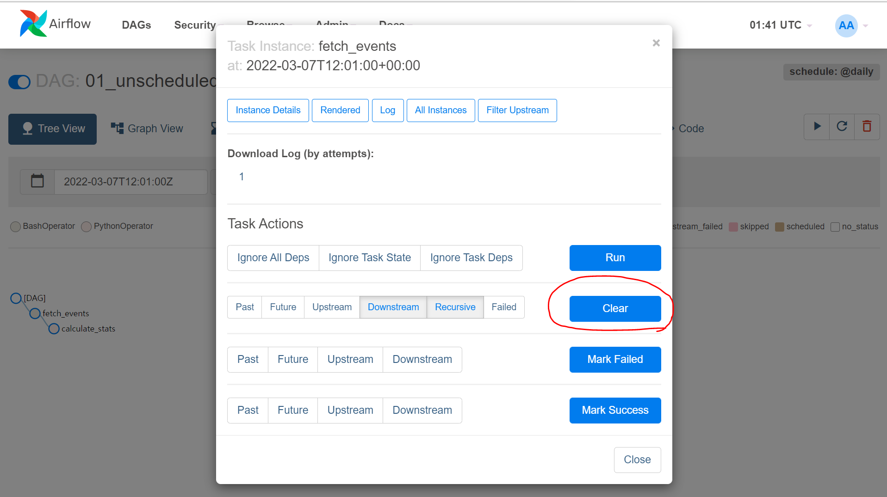
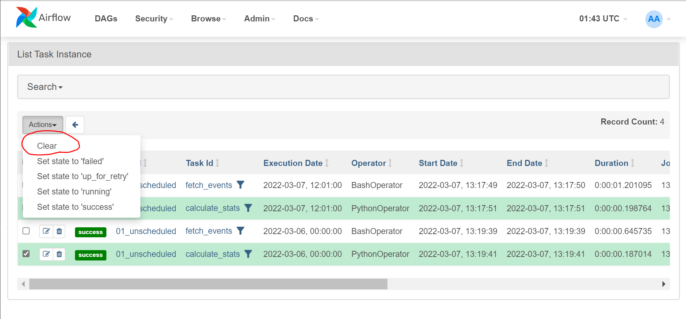

# Task Re-run을 위한 Task Clearing

## 발단
3.5.1의 마지막 문단에 보면, backfilling을 이용해서 reprocessing을 할 수 있다고 나와있다.
여기까지는 이해가 갔는데, **backfilling을 이용하면** `calc_statistics` 함수를 변경하고 이걸 실행하는 task의 과거 run들을 clear하여 이 부분들만 다시 실행할 수 있다고 되어있어 혼란스러웠다.
Backfilling은 `catchup`을 이용해서 과거 interval들에 대해 *DAG 자체를* 수행할지 말지를 지원해준다는 거 같았는데.. 정확히 알기 위해 Airflow의 `catchup`, `backfill`, `task clear` 용어들을 살펴보기로 했다.

## `catchup`
`catchup`은 DAG의 property로 bool 값을 지정해줌으로써 사용할 수 있다.
`start_date`가 현재 스케줄링 시점보다 더 과거에 있고, interval이 존재할 때 해당 interval들에 대한 DAG Run을 수행할지 말지를 지정해준다.

## `backfill`
기본적으로 `backfill`은 `catchup`의 값에 따라서 자동으로 수행되는 action이라고 볼 수 있고 책에서도 그렇게 설명하고 있다.
찾아보니 Airflow에서는 `backfill`을 위한 CLI 커멘드를 별도로 제공하여 `catchup` 값에 무관하게 임의로 실행할 수 있도록 한다.
유저가 DAG의 start_time보다 더 이전의 데이터를 필요로 한는 등의 usecase를 커버할 수 있도록 한다.
```bash
# re-run all the instances of dag_id for all the intervals
# within the start date and end date.
airflow dags backfill \
    --start-date START_DATE \
    --end-date END_DATE \
    dag_id
```

## `Task clear`
Airflow의 webserver UI나 CLI를 통해서 task clearing을 수행할 수 있다.
사용해본 결과 clear 하게 되면 바로 clear 된 DAG나 task가 재실행 된다.
에러가 나서 fail 했던 task를 다시 수행하려고 할 수도 있을 것이고, 책의 예제에 나온거처럼 특정 함수만 다시 돌리고 싶을 수도 있다.
그런 경우에 사용하면 된다.

### DAG Tree view를 이용해 Clear 하기

Tree view에 나와있는 노드를 클릭하면 여러 메뉴들을 볼 수 있는데 그 중에서 clear 버튼이 있다.
Clear 할 때 past, future, upstream 등 여러가지 option이 주어지는데 [해당 옵션](https://airflow.apache.org/docs/apache-airflow/stable/dag-run.html#re-run-tasks)에 따라서 과거의 것들, downstream의 것들을 한꺼번에 clear 할 수 있다.

### DAG Details 페이지를 이용해 Clear 하기

DAG 페이지의 Details 메뉴에 들어가게 되면 여지껏 실행했던 task들을 쭉 볼 수 있다.
Clear 하고싶은 task를 선택해서 clear 액션을 선택하면 된다.

### CLI를 이용해 Clear 하기
```bash
# Clear all instances of the tasks matching the regex
# for the specified dag_id and time interval.
airflow tasks clear dag_id \
    --task-regex task_regex \
    --start-date START_DATE \
    --end-date END_DATE
```
CLI도 tree view에서 제공하는 여러 옵션들을 제공한다. 자세한건 [여기](https://airflow.apache.org/docs/apache-airflow/stable/cli-and-env-variables-ref.html#clear)를 참고.


## Discussion
이걸 찾아봤던 발단은 과연 task를 clear 했을 때 `backfill`이 task들을 재실행하게 해주는 메커니즘이었냐였다.
위에서 찾아본 것으로는 그 의문을 해결할 수 없었고, 직접 실험해보는 수밖에 없없다.
`catchup=False`로 해놓으면 `backfill`이 동작하지 않는다는 세팅으로 `catchup`을 `True`로 했을 때와 `False`로 했을 때 task clear 시 재실행이 자동으로 되는지 실험해봤다.
결과는 둘 다 task clear 시에 자동으로 재실행하는 것으로 관찰됐다.

즉, DAG 전체가 아니고 과거의 특정 task만 재실행하고 싶다면 해당 task들만 clear 해주면 되고, backfilling과는 관련이 없었다.
책에서 지칭한 backfilling이 이 개념을 포괄한 용어일 수도 있지만, Airflow에서는 별도로 `backfill`이라는 기능도 제공해서 혼란스러웠다.

## 참고자료
- [Airflow: DAG Runs](https://airflow.apache.org/docs/apache-airflow/stable/dag-run.html#catchup)