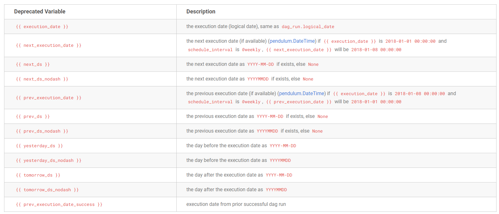
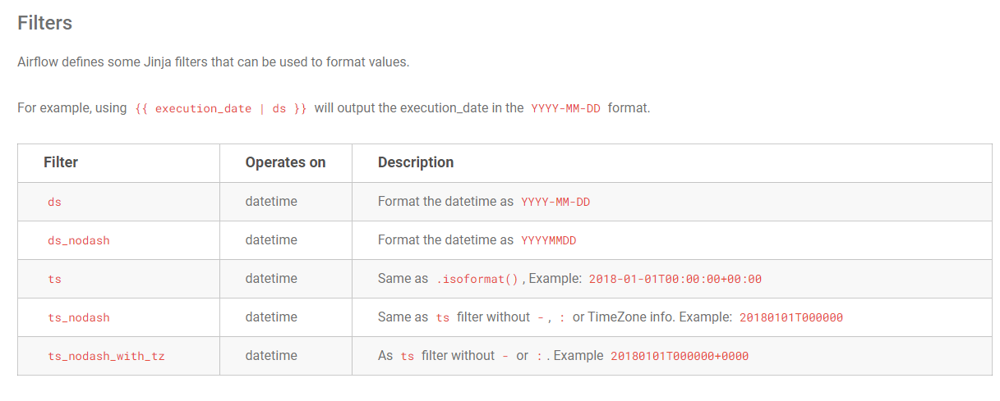
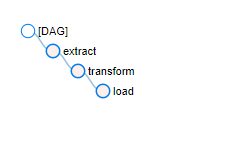
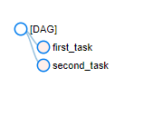
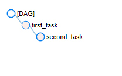

# Deprecated values for templating

## 발단
책에서는 `next_ds`, `prev_ds`등을 사용하고 있지만, log에서 다음과 같은 warning이 뜨는 것을 알게되었다.

    ```python
    [2022-03-08, 03:33:40 UTC] {warnings.py:110} WARNING - /home/***/.local/lib/python3.7/site-packages/***/utils/context.py:156: AirflowContextDeprecationWarning: Accessing 'next_ds' from the template is deprecated and will be removed in a future version. Please use '{{ data_interval_end | ds }}' instead.
    ```

## deprecated values and template filter
현재 양식에서는 {{ data_interval_end | ds }}와 같이 `next_ds`를 사용해 주어야 한다.
다음은 deprecated 된 templates들이다.
[Deprecated Values](https://airflow.apache.org/docs/apache-airflow/stable/templates-ref.html#:~:text=The%20following%20variables%20are%20deprecated.%20They%20are%20kept%20for%20backward%20compatibility%2C%20but%20you%20should%20convert%20existing%20code%20to%20use%20other%20variables%20instead.)
<p align="left">
    
</p>

`| ds`는 filter 문법이다.
<p align="left">
    
</p>

# Getting context with python operator

## 발단
python operator에서 `{{ds}}`와 같은 template를 사용해보려고 하였다. 그러나 date format string이 아닌 `{{ds}}`가 그대로 출력되었다. 따라서, python operator에서는 jinja가 아닌 다른 방식으로 context를 불러옴을 알 수 있었다.
```python
def next_ds_python():
    print("{{ds}}") # does not work. The result is "{{ds}}" but not the date format we wanted.
```


## 두 가지 context load method: old and new

### parameter로 불러오기: old(deprecated 아님)
사용할 python function의 parameter에 불러올 context의 이름을 적어주거나, kwargs로 전체 context를 불러올 수 있다.
```python
def my_task(ds=None):
    print(ds) # as expected, date format
```

```python
def my_task(**context):
    ds = context["ds"]
    print(ds) # as expected, date format
```

### get_current_context를 이용해 불러오기: new
```python
from airflow.operators.python import get_current_context


def my_task():
    context = get_current_context()
    ds = context["ds"]
```

# Taskflow API는 자동으로 dependency를 세팅한다

## 발단
Taskflow api 예제코드를 돌려보니, dependency가 자동으로 세팅되는 것을 확인할 수 있었다. 한 task의 return 값이 다른 task에서 사용된다면, taskflow는 이 둘 사이의 dependency를 자동으로 생성한다. 그렇다면 이러한 automatic dependency setting의 한계는 무엇인가?
[Taskflow API 예제코드](./taskflow_with_automatic_dependencies.py)
<p align="left">
    
</p>

## return이 다른 task에 넣어지지 않을 경우: automatic dependency setting - X
[Taskflow without dependencies](./taskflow_without_dependencies.py)
<p align="left">
    
</p>

## return이 다른 task에 넣어지지 않아 automatic dependency setting이 일어나지 않더라도, `A >> B`와 같은 방식으로 dependency 세팅 가능!
[Taskflow with manual dependencies](./taskflow_with_manual_dependencies.py)
<p align="left">
    
</p>

## 참고자료
- [Airflow: Templates reference](https://airflow.apache.org/docs/apache-airflow/stable/templates-ref.html)
- [Airflow: get_current_context](https://airflow.apache.org/docs/apache-airflow/stable/_api/airflow/operators/python/index.html?highlight=get_current_context#airflow.operators.python.get_current_context)
