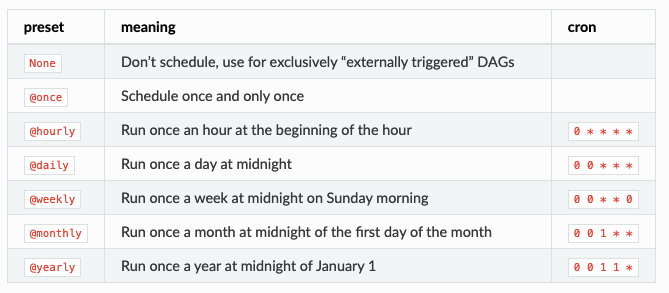
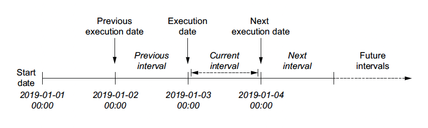
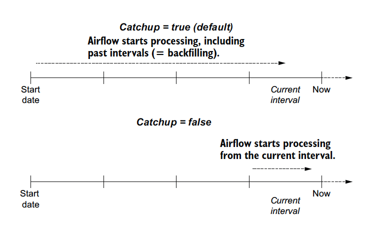

# Scheduling in Airflow

### This chaper handles
 - Dag 스케쥴 세팅하기
 - interveral-based scheduling 이해하기
 - backfilling 세팅하기
 - task 구현의 원칙: atomicity & idempotency


### [예제](https://github.com/BasPH/data-pipelines-with-apache-airflow/blob/master/chapter03/dags/01_unscheduled.py): 일간 유저 이벤트 통계내기
  - local API를 통해 유저 이벤트를 json으로 저장
    - 최대 30일 전까지 데이터 제공
  - json을 읽어서 일간, 유저별 통계 계산
    - pandas dataframe groupby 사용


### 스케쥴 관련 DAG parameters
- start_date
- schedule_interval
- end_date (optional)

### 스케쥴링시 주의사항
- 실제 첫 실행 시점은 start_date + schedule_interval이며, start_date때 실행되는게 아니다.
- end_date에는 실행된다.
- 여기에 대해서는 아래서 더 자세히 다룬다.

### schedule_interval 파라미터 설정
- [airflow preset](https://airflow.apache.org/docs/apache-airflow/1.10.1/scheduler.html#dag-runs) 사용

  
- cron-based interval
  - 크론 문법에 따라 복잡한 스케쥴링이 가능하다.
  - 언제 실행 시킬지 규칙을 지정하는 데 유리하지만, 특정 주기별로 실행시키기는 힘들다 (예: 3일에 한 번)
- frequency-based intervals
  - `datetime.timedelta`를 사용해 실행 주기를 설정할 수 있다.

### dynamic time reference
- 아래와 같이 커맨드에 실행일자가 필요한 경우가 있다.
  ```python
  fetch_events = BashOperator(
      task_id="fetch_events",
      bash_command=(
          "mkdir -p /data && "
          "curl -o /data/events.json "
          "http:/ /localhost:5000/events?"
          "start_date=2019-01-01&"
          "end_date=2019-01-02"
      ),
      dag=dag,
  )
  ```
- airflow operator에서 제공하는 template 기능을 이용하여 실행할 때마다 동적으로 실행 시점을 참조할 수 있다.
  ```python
  fetch_events = BashOperator(
      task_id="fetch_events",
      bash_command=(
          "mkdir -p /data && "
          "curl -o /data/events.json "
          "http:/ /localhost:5000/events?"
          "start_date={{ds}}&"
          "end_date={{next_ds}}"
      ),
      dag=dag,
  )
  ```
  - [jinja](https://jinja.palletsprojects.com/en/3.0.x/)의 template syntax를 따른다.
  - 미리 정의된 execution time 관련 변수를 사용할 수 있다.
    - `ds`: execution_date.strftime('%Y-%m-%d'), DATA_INTERVAL_START

### Templating
  - [여기](https://airflow.apache.org/docs/apache-airflow/stable/templates-ref.html)서 예약 변수 목록을 확인할 수 있다.
  - [CLI tool](https://airflow.readthedocs.io/en/1.10.14/cli-ref.html#render)을 통해서 템플릿 렌더링이 잘 되는 지 확인해볼 수 있다.
  - `PythonOperator`의 경우 [예제](https://github.com/BasPH/data-pipelines-with-apache-airflow/blob/master/chapter03/dags/08_templated_path.py)와 같이 templates_dict 파라미터를 통해 넘겨줄 수 있다.
    - 혹은 [이런 식으로](https://airflow.apache.org/docs/apache-airflow/stable/concepts/operators.html#concepts-jinja-templating) `template_fields`가 정의된 class instance를 op_args로 넣어줄 수 있나보다.


### Execution date의 이해



- interval 기준으로 interval start / interval end로 나뉠 수 있을텐데.
  - 실제 dag이 실행되는 시점은 interval end다.
  - 하지만 이 interval을 대표하는 시간은 interval start로 보는게 보다 합리적이라 execution_date를 interval start로 두는 것 같다.
  - 예를 들어 2019-01-03 00:00 <= x < 2019-01-04 00:00의 시간 동안 축적된 데이터에 대해서 작업을 하는데 2019-01-04로 적기는 뭐해서..

### Backfilling



- DAG constructor에서 catchup 파라미터를 통해 이전 인터벌에 대한 실행을 할 지 말 지 결정할 수 있다.
- 이 파라미터의 디폴트 값은 airflow config의 catch-up_by_default 항목에서 세팅이 가능하다.


### Atomicity & Idempotency

- Atomicity
  - 대충 작업 단위를 잘 쪼개라는 내용
  - one operation == one task를 원칙으로 두되 서로 엄청난 dependency를 갖고 있다면 한 task로 관리하자

- Idempotency
  - 같은 input으로 여러 번 돌려도 같은 결과가 나오도록, 부수작용이 없도록 코드를 작성하자.
  - 예를 들어 task의 input으로 참조되는 파일을 append 모드로 계속 내용을 추가하는 것은 지양해야.
