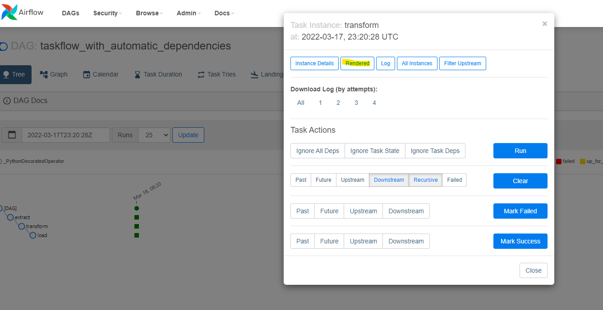
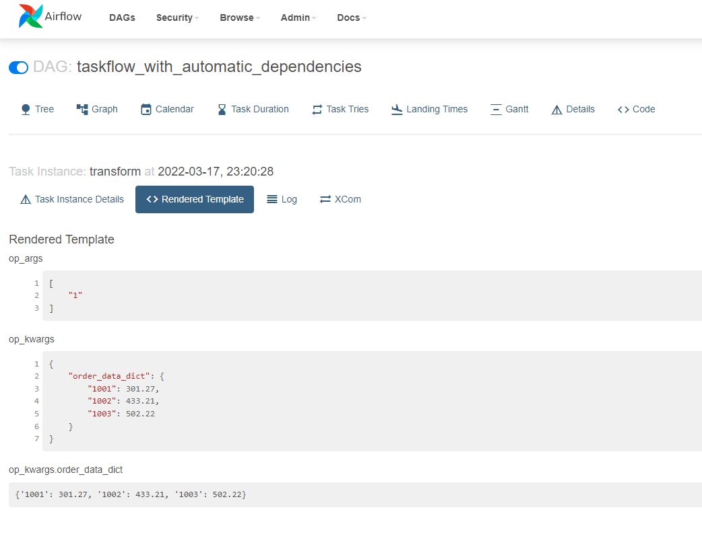
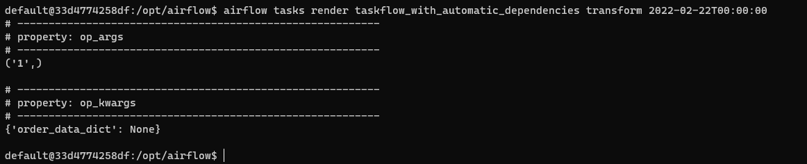
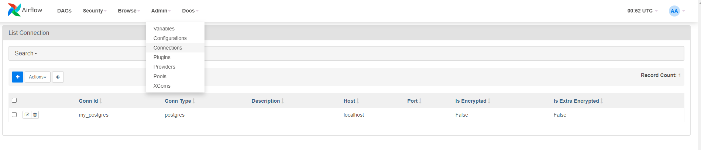
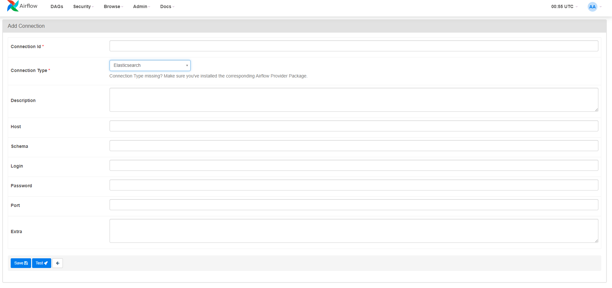

# Templating tasks using the Airflow context

### This chapter handles

- 템플릿을 적용된 variable을 렌더링
- PythonOperator vs 다른 operator들 (variable 템플레이팅의 방식이 다름!)
- 디버깅을 위해 템플릿이 적용된 변수들을 렌더링하기
- 외부 시스템을 operator를 이용하기

### 예제: 주식 예측 툴

- 가정: 한 회사에 대한 wikipedia 페이지의 단위 기간 당 조회 수와 대중이 그 회사에 대한 호감도(긍정적인 감정)는 양의 상관관계를 가짐. 또한 한 회사의 대한 호감도가 높을 수록 그 회사의 주식이 오를 가능성이 높음. 따라서, 한 회사에 대한 wikipedia page 단위기간 당 조회수를 통해 그 회사의 주식이 추이를 예측할 수 있음.
- process:
  - 1시간에 1번씩, 단위시간 1시간의 pageview 데이터 wikipedia로부터 다운로드
  - unzip data
  - read data
  - insert data to DB

### Airflow로 프로세싱할 데이터 조사하기

#### 어떻게 incremental data(단위 시간 당의 데이터)를 불러올/처리할(load) 것인지 정하기

- 데이터의 usecase에 맞춰서 데이터를 불러올/처리할 방식을 정할 것!
- 파이프라인을 설계하면서 다루어야 할 예제 질문: "이 데이터를 다시 프로세싱하는 경우가 있을까?", "어떻게 데이터를 받아야할까?(주기, 데이터 사이즈, 포맷 등)"

### Task context와 Jinja Templating

이미 사용법은 chap.3에서 다루었지만, 이게 *어떻게 작동하는지*에 대해서 알아보도록 하자

- 템플레이팅의 목적: 코딩 시에 정해지지 않고, 실행시에 정해지는 값들을 편리하게 집어넣기.

#### Operator의 매개변수(argument)에 템플레이팅 하는 방법

```python
get_data = BashOperator(
    task_id="get_data",
    bash_command=(
        "curl -o /tmp/wikipageviews.gz "
        "https://dumps.wikimedia.org/other/pageviews/"
        "{{ execution_date.year }}/"
        "{{ execution_date.year }}-{{ '{:02}'.format(execution_date.month) }}/"
        "pageviews-{{ execution_date.year }}"
        "{{ '{:02}'.format(execution_date.month) }}"
        "{{ '{:02}'.format(execution_date.day) }}-"
        "{{ '{:02}'.format(execution_date.hour) }}0000.gz"
    ),
    dag=dag,
)
```

- `{{execution_data}}` 와 같이 정해진 variable을 받을 뿐 아니라, `{{ '{:02}'.format(execution_date.day) }}`와 같이 python expression을 넣는 것도 가능
- `execution_date`와 같은 datetime type은 python의 datetime이 아니라, pendulum을 사용한다. pendulum은 datetime의 모든 기능을 가지고 있으므로, datetime과 똑같이 사용할 수 있다.
- templating되는 operator의 field(argument)는 해당 Operator의 class attribute인 `template_fields`에 정의되어 있다.

#### 템플레이팅 가능한 variable들

1. [여기](https://airflow.apache.org/docs/apache-airflow/stable/templates-ref.html)에서 예약 변수 목록을 확인할 수 있다. Chapter 3에서 보앗듯, 책과 달리 deprecated 된 variable들 존재함.
2. PythonOperator를 통해서 task context를 받아와 variable들을 확인할 수 있다.

```python
def _print_context(**context):
    print(context)
```

#### Python operator에 templating하기

- Python function 내부에서는 Jinja Templating이 먹히지 않는다.
  ```python
  def next_ds_python():
      print("{{ds}}") # does not work. The result is "{{ds}}" but not the date format we wanted.
  ```
- 대신 context와 기타 variable들을 argument로 표기하여 `execution_time`과 같은 context로 받아올 수 있다. (airflow1 에서는 `provide_contest=True`여야 함)

  ```python
  def my_task(ds=None):
      print(ds) # as expected, date format
  ```

  ```python
  def my_task(**context):
      ds = context["ds"]
      print(ds) # as expected, date format
  ```

- op_kwargs/op_args를 통해 보내진 값들은, 해당 function에 argument가 지정되어 있다면 해당 argument이름으로 보내지고, 아니라면 **kwargs(**context)가 존재할 시에는 kwargs/context로 보내진다.
- Note: get_current_context를 이용해 불러오기: new, context와 다른 argument의 분리가 용이!

  ```python
  from airflow.operators.python import get_current_context


  def my_task(first_argument: str):
      context = get_current_context()
      ds = context["ds"]
      print(first_argument)
  ```

- Note: op_kwargs/op_args를 통해 templating/rendering된 variable은 string이지만, variable의 원래 type으로도 가져올 수 있다. [rendering fiedls as native python objects](https://airflow.apache.org/docs/apache-airflow/stable/concepts/operators.html#rendering-fields-as-native-python-objects)

#### Python operator에 variable 전달하기

Python function 안에서 Jinja templating을 사용할 수는 없지만, PythonOperator의 op_args/op_kwargs의 value에는 Jinja Templating이 가능하다. [예](https://github.com/BasPH/data-pipelines-with-apache-airflow/blob/master/chapter04/dags/listing_4_13.py#L14)

```python
# Listing 4.13
def _get_data(year, month, day, hour, output_path, **_):
    url = (
        "https://dumps.wikimedia.org/other/pageviews/"
        f"{year}/{year}-{month:0>2}/pageviews-{year}{month:0>2}{day:0>2}-{hour:0>2}0000.gz"
    )
    request.urlretrieve(url, output_path)

get_data = PythonOperator(
    task_id="get_data",
    python_callable=_get_data,
    op_kwargs={
        "year": "{{ execution_date.year }}",
        "month": "{{ execution_date.month }}",
        "day": "{{ execution_date.day }}",
        "hour": "{{ execution_date.hour }}",
        "output_path": "/tmp/wikipageviews.gz"
    },
    dag=dag,
)

```

or

```python
get_data = PythonOperator(
    task_id="get_data",
    python_callable=_get_data,
    op_args=[
        "{{ execution_date.year }}",
        "{{ execution_date.month }}",
        "{{ execution_date.day }}",
        "{{ execution_date.hour }}",
        "/tmp/wikipageviews.gz"
    ],
    dag=dag,
)
```

- Note: PythonOperator의 template_fields가 ('templates_dict', 'op_args', 'op_kwargs') 이기 때문이다.

#### 템플레이팅 된 매개변수 검사하기(TaskFlow API도 동일)
두가지 방법이 존재한다.
1. Airflow 웹에 접근해 rendered 된 task의 매개변수 확인하기

    

    

    - 해당 task가 scheduling이 되어 있어야만 확인할 수 있다.
        - 이는 당연하기도 한데, scheduling이 되어 있지 않으면 원하는 날짜의 실행기록에 접근하여 rendered 페이지에 들어갈 수 없기 때문이다.
    - 따라서, 아직 scheduling이 되지 않은, 개발단계에서는 적합하지 않은 방식일 수 있다.

2. Airflow CLI 이용하기
`airflow tasks render [dag id] [task id] [원하는 실행 일]` 로 테스트를 할 수 있다.


해당 커맨드는 Airflow의 작동 기록에 남지 않는다(metastore에 남지 않는다). 따라서 더 가볍고 유연하게 테스트할 수 있다.

 - Note:오직 원하는 task만을 실행하기 때문에, 전/후의 task는 실행되지 않는다
    - 따라서, 전의 task에서 값을 불러오는 경우, 해당 argument는 None으로 처리된다.
    - `order_data_dict`는 원래 None이 아니다. 다만 전의 task에서 값이 도출되기에 None으로 처리되었다.

### 다른 시스템과 연결하여 사용하기(DB 사용 예)

#### 데이터를 한 task에서 다른 task로 이동하는 방법 2가지
한 task에서 return된 data를 다른 task에서 사용하고자 할 때 주의할 점은, 각 task가 실제로 실행되는 system이 물리적으로 분리되어 있을 수 있다는 것이다. 따라서, 메모리를 통해서 데이터를 교환하는 것은 어렵다. 데이터는 두 태스크가 접근할 수 있는 곳에 영구적으로 보관되어 있어야 한다.
1. Xcom(chapter.5에서 더 다룰 예정). Airflow의 metastore를 이용하는 방식으로, data를 pickle하여 DB의 blob으로 저장.
    - [아래](./taskflow_with_automatic_dependencies.py)와 같이 task 사이에 데이터를 주고받는 경우 각 return은 pickle된 후 Airflow의 metastore에 blob으로 저장된다. 그 후 다음 task가 실행될 때, DB에서 불러와져 넘겨진다.
    ```python
    @task()
    def extract():
        """
        #### Extract task
        A simple Extract task to get data ready for the rest of the data
        pipeline. In this case, getting data is simulated by reading from a
        hardcoded JSON string.
        """
        data_string = '{"1001": 301.27, "1002": 433.21, "1003": 502.22}'

        order_data_dict = json.loads(data_string)
        return order_data_dict

    @task(multiple_outputs=True)
    def transform(positional_arg: int, order_data_dict: dict):
        """
        #### Transform task
        A simple Transform task which takes in the collection of order data and
        computes the total order value.
        """
        total_order_value = 0

        for value in order_data_dict.values():
            total_order_value += value

        return {"total_order_value": total_order_value}
    ```
    - 적은 양의 string을 전달하는 것에 적합한 방식이다.
        - Discussion
            - 예를 들어, 전 태스크에서 처리한 데이터를 보관한 filename을 전달하는 용도로 사용하는 것이 바람직할 듯 하다.
            - pickle되어 blob으로 metastore에 저장되기 때문에 데이터가 클 경우 이 데이터를 inspect하는데 애로사항이 꽃필 수 있다!

2. 디스크나 DB와 같이 영구적인 공간에 중간 데이터를 보관하기
 - 대량의 data를 전달하는 것에 적합한 방식이다.
 - 중간 데이터를 체크하기 더욱 용이하다.
책에서는 [PythonOperator를 이용해 pageview를 processing하여 고정된 이름으로 file을 남기고, 이를 다른 sql구문으로 만들어 file에 저장하고 있다.](https://github.com/BasPH/data-pipelines-with-apache-airflow/blob/master/chapter04/dags/listing_4_20.py#L49) PostgresOperator는 이렇게 남겨진 [sql구문에 접근하여 DB에 데이터를 임포트한다.](https://github.com/BasPH/data-pipelines-with-apache-airflow/blob/master/chapter04/dags/listing_4_20.py#L73)

    ```python
    def _fetch_pageviews(pagenames, execution_date):
        result = dict.fromkeys(pagenames, 0)
        with open("/tmp/wikipageviews", "r") as f:
            for line in f:
                domain_code, page_title, view_counts, _ = line.split(" ")
                if domain_code == "en" and page_title in pagenames:
                    result[page_title] = view_counts

        with open("/tmp/postgres_query.sql", "w") as f:
            for pagename, pageviewcount in result.items():
                f.write(
                    "INSERT INTO pageview_counts VALUES ("
                    f"'{pagename}', {pageviewcount}, '{execution_date}'"
                    ");\n"
                )


    fetch_pageviews = PythonOperator(
        task_id="fetch_pageviews",
        python_callable=_fetch_pageviews,
        op_kwargs={"pagenames": {"Google", "Amazon", "Apple", "Microsoft", "Facebook"}},
        dag=dag,
    )

    write_to_postgres = PostgresOperator(
        task_id="write_to_postgres",
        postgres_conn_id="my_postgres",
        sql="postgres_query.sql",
        dag=dag,
    )
    ```

#### Postgres DB 접속을 위한 패키지 설치하기
 - PostgresDB, Elasticsearch 등 Airflow는 많은 외부 시스템을 지원하여, Operator로 사용할 수 있게 한다.
 - Airflow 2 이후에는 이런 패키지들은 Core operator(Bash/PythonOperator)와 달리 별도로 설치를 해주어야한다.
 - `apache-airflow-providers-*`의 형식으로 모든 외부 패키지가 naming되어 있다.
 - 예:
    ```bash
    $ pip install apache-airflow-providers-postgres
    ```

#### Connection 정보 설정하기
PostgresOperator를 사용하기 위해서는 connection을 위한 정보를 metastore에 저장해야 한다.
```bash
airflow connections add \
--conn-type postgres \
--conn-host localhost \
--conn-login postgres \
--conn-password mysecretpassword \
my_postgres
```
 - Note: 맨 마지막 my_postgres는 connection의 id이다. 이것을 PostgresOperator에 전달하여 커넥션을 할 수 있다.
 - Note: Connection이 필요한 다른 패키지들의 경우, 해당 패키지의 doc을 확인할 것!
 - Note: AirflowUI를 통해서 connection manage도 할 수 있다!
    

    
 - Note: connection 정보는 metastore에 암호화되어 안전하게 저장된다

 - discussion: TaskFlow API로 connection을 사용할 수 있을까? 정보를 찾아보다가 실패하였다.

#### `template_searchpath`
 - DAG class를 initializing하면서 `template_searchpath`를 넣어줄 수 있다.
 ```python
dag = DAG(
    dag_id="listing_4_20",
    start_date=airflow.utils.dates.days_ago(1),
    schedule_interval="@hourly",
    template_searchpath="/tmp",
    max_active_runs=1,
)
 ```
 - `template_searchpath`:
    - type: str or List[str]
    - default로 dags 폴더는 추가되어 있음!
    - 파일을 찾을 위치를 의미
    - 파일을 찾고, 파일의 내용에 jinja template이 적용된 경우 실행시 렌더링 해줌
        - 예:
        ```bash
        $ echo 'SELECT pageview from Pageviews where datetime > {{execution_date}}' >> /tmp/postgres_query.sql

        $ airflow tasks render listing_4_20 write_to_postgres 2022-02-22T00:00:00
        >>>
            # ----------------------------------------------------------
            # property: sql
            # ----------------------------------------------------------
            SELECT pageview from Pageviews where datetime > 2022-02-22T00:00:00+00:00
        ```

### Operator와 Hook
 - 대부분의 Operator는 어떤 태스크를 진행해야하는지에 대해서 알려준다(what)
 - 다른 시스템에 접속하는 Operator들은 내부적으로 hook을 생성해 접속한다. Hook은 connection/authentication등을 담당한다.Airflow에서는 이 과정을 Operator 내부에 이미 구현해 놓았기 때문에 유저가 hook을 생성하는 부분을 구현할 필요가 없다.