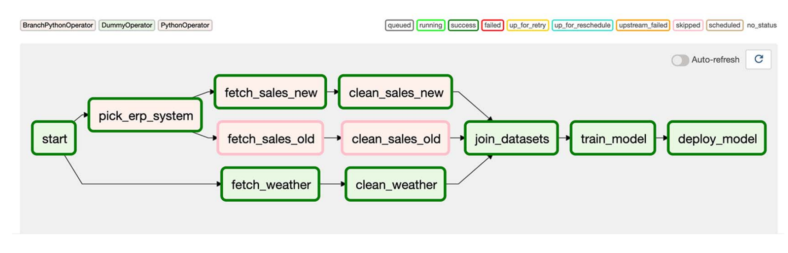

# Defining dependencies between tasks

## Key points:
* Airflow DAG 상에서 Task 간의 dependency를 설정하는 방법
* Task Trigger 규칙에 대한 소개와 Trigger를 이용한 dependency 설정 방법
* XCom을 이용한 Task 간의 상법 공유 방법
* Taskflow API를 이용한 Python 중심의 DAG 단순화 방법

## Basic Dependency Pattern
### 1. Linear dependency
우리가 여태 봐왔던 대부분 예제들의 DAG들은 모두 linear dependency를 가짐.
간단히 말하자면 하나의 task는 이전 task를 완료해야 수행되는 sequential한 구조.
`>>`를 이용해서 단순하게 정의할 수 있었다.

### 2. Fan-in/Fan-out dependency
Chapter01의 Umbrella DAG 예제를 다시 살펴보면 아래와 같은 DAG 구조를 가지고 있다.

`Join data sets`를 수행하기 위해서는 forecast data와 sales data가 모두 준비되어야 하는데 이런 경우를 Fan-in (다대일) dependency라고 한다.
이 경우에는 연결된 두개의 task 모두 완료가 되어야 비로소 그 다음 task가 수행 될 수 있다.
반대의 경우가 Fan-out (일대다) dependency인데, 하나의 task 완료 시 여러 task들이 따라서 수행 될 수 있다.
시작점을 나타내는 DummyOperator를 이용하여 Umbrella DAG에 Fan-out 예시를 아래와 같이 만들어 볼 수 있다.


위 DAG의 Operator들이 정의되어 있다는 가정 하에 dependency를 아래와 같이 정의할 수 있다.
```python
# Fan-out
start >> [fetch_weather, fetch_sales]

# Linear dependencies
fetch_weather >> clean_weather
fetch_sales >> clean_sales

# Fan-in
[clean_weather, clean_sales] >> join_datasets

# Remaining linear part.
join_datasets >> train_model >> deploy_model
```

## Branching
두가지 수행 가능한 Task 종류가 있고 이 중 하나를 선택해야 할 때, 둘 중 하나의 Task로 분기해서 선택적으로 수행 할 수 있다.
예를 들어 Umbrella 예제에서 sales data 수집 소스가 ERP 시스템으로 곧 변경된다고 가정해보자.
변경 전과 변경 후 사이에 학습을 중단시키지 않고, 두 방식 모두 사용 가능하게 하기 위해서 branching이 필요하다.

### 1. Branching within a task :worried:
첫번째 방법은 Operator가 수행하는 로직 자체에서 branch를 구현하는 것이다.
```python
# Example of branch within task
def _clean_sales(**context):
    # NOTE: `execution_date` is deprecated. Use data_interval_start!
    if context["execution_date"] < ERP_CHANGE_DATE:
        _fetch_sales_old(**context)
    else:
        _fetch_sales_new(**context)
```
#### 장점
* DAG 구조를 수정하지 않고 branching 가능
  * 하지만 유사한 task일 때만 적용 가능해서 여전히 제한적..

#### 단점
* DAG 실행 시 어떤 브랜치로 코드가 분기했는지 알기 어렵다.
  * 하나하나 task 내에서 logging을 심어두었다면 가능하겠지만 UI 등으로 쉽게 보기는 힘들다.
* 이러한 branching은 `PythonOperator`와 같은 "일반적인" operator들그만 적용 가능하다.
  * 특정 task에 특화된 Operator들의 장점들이 모두 사용 불가해지는 것.

### 2. Branching in a DAG :relaxed:
첫번째 방법의 단점을 해소시키는 두번째 방법은 분기 되어 실행되는 task들을 각자 따로 개발하고 DAG 상에서 branching하는 특별한 Operator를 추가해 어떤 task를 실핼할 지 결정하는 방법이다.


우선 위 DAG에서 분기할 수 있도록 하는 `Pick ERP System` task는 Airflow에서 제공하는 `BranchPythonOperator`로 구현할 수 있다
(이 외에도 `BranchSQLOperator` 등 다른 Branch Operator가 제공되고 있다.)
이 operator는 python callable을 넘겨 받아서 특정 조건에 맞게 실행하고자 하는 task의 id를 반환하도록 한다 (단일 id or id의 list 가능).
```python
def _pick_erp_system(**context):
    # NOTE: `execution_date` is deprecated. Use data_interval_start!
    if context["execution_date"] < ERP_CHANGE_DATE:
        return "fetch_sales_old"
    return "fetch_sales_new"

pick_erp_system = BranchPythonOperator(
    task_id="pick_erp_system",
    python_callable=_pick_erp_system,
)
```
`pick_erp_system` task를 이용해서 위의 branching DAG를 표현하자면 아래와 같이 작성할 수 있다.
```python
start_task >> pick_erp_system

pick_erp_system >> [fetch_sales_old, fetch_sales_new]

fetch_sales_old >> clean_sales_old
fetch_sales_new >> clean_sales_new

[clean_sales_old, clean_sales_new] >> join_datasets
```

하지만 문제가 하나 더 있다.
앞서 보았던 Fan-in dependency가 `join_datasets` task에 적용이 되어 있고 이 경우에는 `clean_sales_old`, `clean_sales_new`가 모두 완료되어야 `join_datasets`가 실행된다.
우리는 branching 기능을 넣었고 둘 중 하나만 수행 될 것이기 때문에 `join_datasets`가 실행이 되지 않는다.
이렇게 되는 이유는 기본적으로 Airflow에서 task를 트리거하는 규칙이 `all_success`이기 때문이다.
DAG 상으로 branching을 한 경우에는 그에 맞게 영향을 받는 task의 트리거 규칙 (trigger_rule)
을 변경해야 한다.

```python
join_datasets = PythonOperator(
    ...,
    trigger_rule="none_failed",
)
```
이렇게 어떤 Operator든 `trigger_rule` 인자를 이용해서 다양한 규칙을 설정할 수 있는데 규칙에 대한 내용은 [아래](./summary.md/#more-on-trigger-rules)에서 자세히 다룬다. 
보


마지막으로, 여기에 날씨 정보에 대한 flow를 합치게 되면 전체적인 workflow가 잘 보이지 않을 수 있다.

`join_datasets` 태스크를 보면 세개의 task로부터 연결이 되는데, 좀 더 명확하게 하기 위해서 `clean_sales_new`와 `clean_sales_old`를 연결하는 `DummyOperator`를 추가해주면 좋다.

이렇게 되면 `join_datasets`에는 trigger rule을 지정하지 않고 `DummyOperator`에만 추가해주면 된다.
```python
join_branch = DummyOperator(
    task_id="join_erp_branch",
    trigger_rule="none_failed",
)

[clean_sales_old, clean_sales_new] >> join_branch
join_branch >> join_datasets >> deploy_model
```
이런 식으로 dummy task를 이용해 구분을 해주면 DAG가 더 명확해질 뿐만 아니라 브랜치를 독립적으로 유지하여 down stream task를 변경하지 않을 수 있다.

## Conditional Task
어떤 조건에 따라 특정 task를 수행할 지, 건너 뛸 지 선택하고 싶을 수 있다.
Umbrella DAG를 다시 예로 들면, 우리가 이전 데이터도 모두 가져와서 학습을 하려고 해서 DAG를 과거 데이터에 대해서도 수행해야 하는데, 모델을 deploy하는 것은 최신 모델만 하고 싶을 수 있다.

### 1. Condition within a task :worried:
첫번째 방법은 branching 기법과 비슷하게 task 내에 조건문을 활용해서 수행을 할 지 말 지 결정하는 것이다.
```python
def _deploy(**context):
    if latest():
        deploy_model()
    # else do nothing...
```
branching 때와 마찬가지로 DAG 상에서 보기 어렵고, `PythonOperator`만 사용할 수 있는 등 혼란을 초래한다. (실제로 deploy 하지 않았는데 success가 뜨는것도 매우 불편하다.)

### 2. Making a task conditional :relaxed:
두번째 방법은 task 자체를 명시적으로 skip할 수 있게하는 것이다.
Airflow에서는 이 기능을 위해 `AirflowSkipException`을 제공을 하는데, 이 예외를 task에서 raise하게 되면 해당 task가 `skipped`로 표시되고 종료된다.

Umbrella 예제에서 `deploy_model` 자체에서 조건을 확인하고 Exception을 이용해 skip할 수도 있겠지만, DAG를 좀 더 명확하게 하고 generality를 위해서 따로 조건을 확인하는 task를 두는 것이 좋다.

위와 같이 `lastest_only` 태스크를 추가해서 조건을 확인하고 success or skip 상태를 가지게 되고, 이에 따라서 `deploy_model`이 수행되거나 skip 될 수 있다.
```python
from airflow.exceptions import AirflowSkipException

def _lastest_only(**context):
    left_window = context["dag"].following_schedule(context["execution_date"])
    right_window = context["dag"].following_schedule(left_window)

    now = pendulum.now("UTC")  # default time zone in Airflow
    if not left_window < now <= right_window:
        raise AirflowSkipException("Not the most recent run!")
```
`deploy_model`은 트리거 규칙을 수정하지 않아 `all_sucess`가 기본으로 되어있기 때문에 `latest_only`의 결과에 따라 수행 여부가 결정된다.

### Another option for latest run
Airflow에서는 가장 최근의 DAG에서만 실행하기 위해서 `LatestOnlyOperator`를 제공해서 쉽게 사용 가능하다.

## More on Trigger rules
Branching을 설명할 때 나왔듯 task의 결과에 따라 task를 트리거 여부를 결정하기 위해 `trigger_rule` 인자를 넘겨줄 수 있다.
`trigger_rule`은 어떤 task든 task가 실행할 준비가 되어있는지 판단하는 데 쓰인다.
기본 규칙은 `all_success`로, 모든 의존적인 task들이 성공해야 한다.
이전 task 중에 하나라도 오류를 발생시키면 다음 task는 `upstream_failed` 상태가 고어 진행할 수 고 해당 task의 downstream task들도 진행이 불가하다.
downstream task에 영향을 주는 현상을 전파(propagation)라고 한다.

### Trigger rules
Operator에 지정 가능한 `trigger_rule`의 종류는 아래와 같다.

(책에 나온 것과 달리 업데이트 된 것이 꽤 있다.)

조금 특이한 `trigger_rule`만 살펴보자면, `one_failed` 와 `one_sucess` 같은 eager rule도 있다.
이런 규칙은 모든 upstream task의 결과를 기다리지 않고 하나라도 완료되어 fail or success 조건을 만족시키면 바로 수행된다.

## Sharing data between tasks via XCom
Airflow task 간에 데이터를 공유하기 위해 XCom을 사용할 수 있다.
간단한 Message를 전달해서 state를 공유하는데 주로 쓰인다고 보면 된다.
(큰 데이터를 전달하는 것은 권장하지 않는다.)

### Using XCom
Umbrella 예제를 다시 생각해보자.
`train_model`에서 생성 된 id를 이용해 `deploy_model`에서 모델 레지스트리에 등록된다고 가정하자.
이 경우 두 task 사이에 id를 전달할 매개체가 필요하고, XCom이 그 역할을 해준다.
```python
def _train_model(**context):
    model_id = str(uuid.uuid4())
    context["task_instance"].xcom_push(key="model_id", value=model_id)

train_model = PythonOperator(
    task_id="train_model",
    python_callable=_train_model,
)
```
위 코드는 XCom에 데이터를 보내는 방법으로, task instance에서 제공하는 `xcom_push` 메서드를 이용해서 키와 값을 전달한다.
전달된 값은 Web UI에서도 확인 할 수 있다 (Admin > XCom).


반대로, push된 값을 가져오는 메서드는 `xcom_pull`이다.
```python
def _deploy_model(**context):
    model_id = context["task_instance"].xcom_pull(
        task_ids="train_model", key="model_id"
    )
    print(f"Deploying model {model_id}")

deploy_model = PythonOperator(
    task_id="deploy_model",
    python_callable=_deploy_model,
)
```
위 예시에서는 현재 DAG에 해당하는 데이터를 가져왔는데, `dag_id`를 명시적으로 지정해서 특정 dag로부터의 데이터를 가져올 수도 있다.
이때, 만약 특정 dag의 `execution_date` (`data_interval_start`)가 `xcom_pull`을 호출하는 DAG보다 이전 날짜라면 (아마 거의 그럴것이라고 생각한다) 이전 실행날짜를 포함할지 여부를 나타내는 `include_prior_dates`를 `True`로 설정해야 접근 가능하다.

템플릿을 통해서도 XCom 값을 참조 할 수 있다.
```python
def _deploy_model(templates_dict, **context):
    model_id = templates_dict["model_id"]
    print(f"Deploying model {model_id}")

deploy_model = PythonOperator(
    task_id="deploy_model",
    python_callable=_deploy_model,
    templates_dict={
        "model_id": "{{task_instance.xcom_pull(
            task_ids='train_model', key='model_id')}}"
    }
)
```
위와 같이 Airflow에서 제공하는 template variable인 `task_instace` or `ti`를 사용하면 된다.


이렇게 명시적으로 사용자가 XCom에 데이터를 보내는 것 말고도, 대부분의 Operator에서 자동으로 결과를 push 해주는 옵션을 제공한다.
Operator 생성 시 인자로 `do_xcom_push=True`로 해주면 결과가 `return_value`라는 키로 등록이 된다.
`PythonOperator`의 경우 함수의 return value가 자동으로 등록된다.
(책에 나온 `BashOperator`의 xcom_push 옵션은 deprecated 되었음.)

### Notes on using XCom
XCom을 사용할 때 유의해야 할 점들이 몇가지 있다.
* 어떤 task에서 XCom으로부터 값을 pull하여 사용한다는 것은 *implicit dependency*가 있다는 뜻이다. Explicit한 dependency가 아니기 때문에 DAG에도 표시되지 않고 스케줄링에 고려되지 않는다. 따라서 복잡한 dependency는 피해야한다.
* Airflow에서 권장하는 atomicity를 해칠 수 있다. 한 task에서 단독으로 해결할 수 있는 것들은 그렇게 디자인 하는 것이 좋다.
* XCom을 통해 전달하고자 하는 값은 serializable 데이터여야 한다. 또한 XCom은 meta store에 저장되기 때문에 백엔드에 따라 크기가 제한될 수 있다.
  * SQlite - BLOB, limited to 2GB
  * PostgreSQL - BYTEA, limited to 1GB
  * MySQL - BLOB, limited to 64KB

### Custom XCom backends
기본적으로 XCom 사용 시 Airflow의 메타스토어를 사용하는데, 데이터의 크기와 포맷이 메타스토어에 종속된다.
Airflow 2.0에서는 custom XCom backend를 지원하여 S3, GCS, HDFS 등의 external system을 XCom 저장소로 사용할 수 있게 한다.
`BaseXCom`을 상속하여 static method인 `serialize_value`와 `deserialize_value`를 오버라이드 해주면 된다.
이렇게 하게 되면 실질적으로 serializable이 아닌 데이터도 전송할 수 있게 되고, 큰 데이터들에 대해서도 대응 가능하다.

아래는 S3를 사용하는 Custom backend 예제 코드이다.
이 예제에서는 pandas Dataframe 데이터를 csv 형태로 변환하여 S3에 저장하고, 또 가져오는 작업을 수행할 수 있다.
S3 path는 메타스토어에 저장되어 사용되는 듯 하다...

```python
# Code from https://www.astronomer.io/guides/custom-xcom-backends
from typing import Any
from airflow.models.xcom import BaseXCom
from airflow.providers.amazon.aws.hooks.s3 import S3Hook

import pandas as pd
import uuid

class S3XComBackend(BaseXCom):
    PREFIX = "xcom_s3://"
    BUCKET_NAME = "your-bucket-name"

    @staticmethod
    def serialize_value(value: Any):
        if isinstance(value, pd.DataFrame):

            hook        = S3Hook()
            key         = "data_" + str(uuid.uuid4())
            filename    = f"{key}.csv"

            value.to_csv(filename)
            hook.load_file(
                filename=filename,
                key=key,
                bucket_name=S3XComBackend.BUCKET_NAME,
                replace=True
            )
            value = S3XComBackend.PREFIX + key
        return BaseXCom.serialize_value(value)

    @staticmethod
    def deserialize_value(result) -> Any:
        result = BaseXCom.deserialize_value(result)
        if isinstance(result, str) and result.startswith(S3XComBackend.PREFIX):
            hook    = S3Hook()
            key     = result.replace(S3XComBackend.PREFIX, "")
            filename = hook.download_file(
                key=key,
                bucket_name=S3XComBackend.BUCKET_NAME,
                local_path="/tmp"
            )
            result = pd.read_csv(filename)
        return result
```

`AIRFLOW__CORE__XCOM_BACKEND` 환경변수를 이용해서 Custom backend를 지정하여 사용하면 된다.
자세한 내용은 [여기](https://www.astronomer.io/guides/custom-xcom-backends)를 참고.

## Task chaining with TaskFlow API
Airflow 2.0에서 추가된 TaskFlow API를 사용하면 XCom을 직접 사용하지 않고도 task 간에 데이터 전달을 쉽게 할 수 있다.
`PythonOperator`를 사용하는 경우 XCom을 사용하는 것보다 훨씬 단순해진다는 장점이 있다.

대부분의 내용이 [챕터3의 discussion](../chapter04/taskflow_api.md)에서 상세히 다뤄졌기 때문에 과감히 생략하겠다.