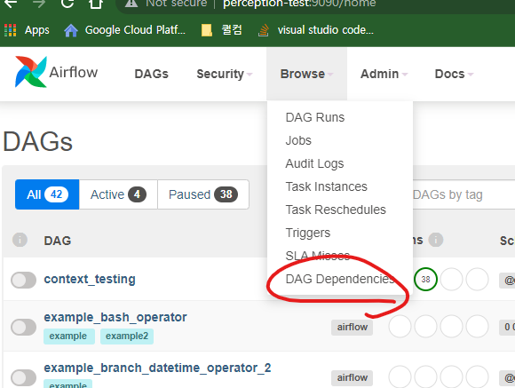
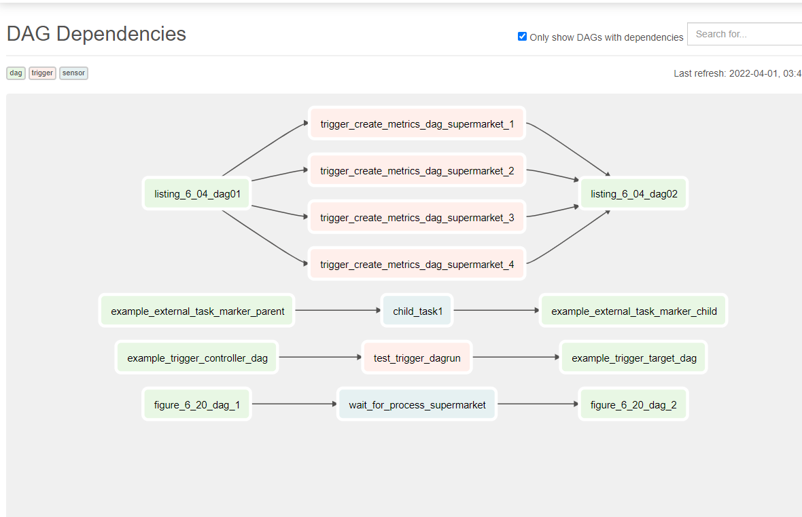
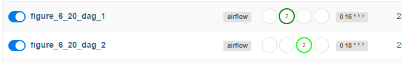

## airflow-dag-dependencies는 기존에 외부 plug-in이었으나, airflow의 기본 기능으로 포함되었다.(2021-5-8)
 - plugin repo :https://github.com/ms32035/airflow-dag-dependencies
 - 방법:
    - airflow의 상단 menu 중 browse > DAG dependencies
        
    - 이제 dag 간의 dependency를 간단하게 확인할 수 있다.
        

## 실행되지 않는 figure_6_20..?

### 발단
내용은 그리 어려울게 없다고 생각하고, example repo의 figure_6_20의 `ExternalTaskSensor`를 실행해보았다. 그러나 실행이 되지 않는다. 값을 바꿔보며, 심지어 schedule interval도 동일하게 맞추어 봤지만... 여전히 작동하지 않는다!

### 코드
```python
import datetime

import airflow.utils.dates
from airflow import DAG
from airflow.operators.dummy import DummyOperator
from airflow.sensors.external_task import ExternalTaskSensor

dag1 = DAG(
    dag_id="figure_6_20_dag_1",
    start_date=airflow.utils.dates.days_ago(3),
    schedule_interval="0 16 * * *",
)
dag2 = DAG(
    dag_id="figure_6_20_dag_2",
    start_date=airflow.utils.dates.days_ago(3),
    schedule_interval="0 18 * * *",
)

DummyOperator(task_id="copy_to_raw", dag=dag1) >> DummyOperator(
    task_id="process_supermarket", dag=dag1
)

wait = ExternalTaskSensor(
    task_id="wait_for_process_supermarket",
    external_dag_id="figure_6_20_dag_1",
    external_task_id="process_supermarket",
    execution_delta=datetime.timedelta(hours=6),
    dag=dag2,
)
report = DummyOperator(task_id="report", dag=dag2)
wait >> report
```
보시다시피 전혀 문제가 없어보인다....

### 현상
