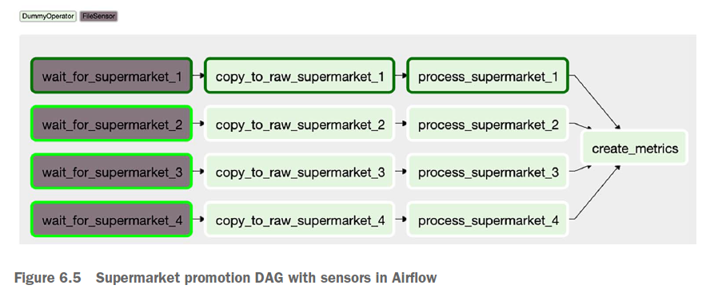
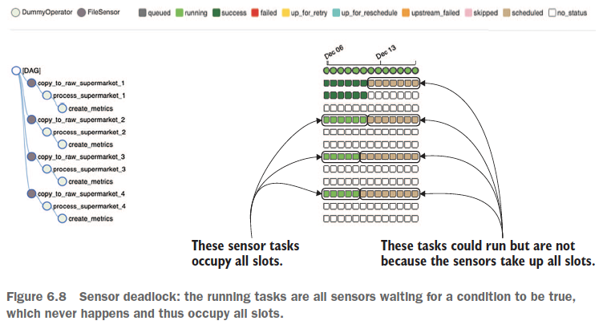
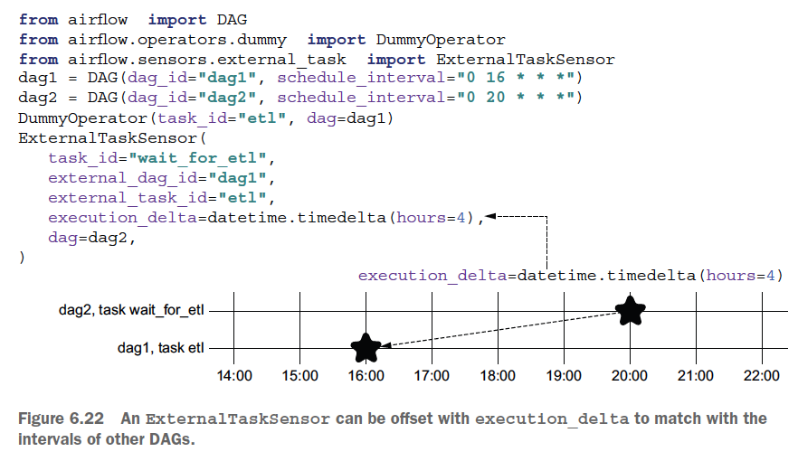

## Triggering workflows

이전의 챕에서 schedule 기반의 dag run에 대해 살펴보았다.
이번 챕터에서는 다음과 같은 스케쥴링 이외의 트리거링 방법에 대해서 살펴본다.


1. Polling conditions with sensors
2. Triggering other DAGs
3. Starting workflows with REST / CLI

### Polling conditions with sensors

`Sensor`
 - Operator의 일종 (더 정확하게는 Operator의 subclass)
 - 특정 condition이 만족될 때까지 일정 주기로 확인
 - timeout 설정 가능하다 (default: 7일)
   - soft_fail 설정을 통해 timeout시 SKIP 처리 할 지 (soft_fail=True) FAIL 처리 할 지 (soft_fail=False) 결정할 수 있다.
 - poke_interval 설정 가능하다. (default: 60초)
 - ex: FileSensor, S3KeySensor, SqlSensor, DateTimeSensor, ...

`Poking`
 - Sensor가 condition을 만족하는 지 확인하는 작업

`FileSensor`
 - airflow.sensors.filesystem.FileSensor
 - file existance를 검사하는 Sensor
 - filepath의 경우 glob의 파일 패턴으로 입력 가능
 - UI 상으로 검정색으로 표시되어서 다른 task들과 구분된다
    

`PythonSensor`
 - airflow.sensors.python.PythonSensor
 - python_callabale을 통해서 polling condition을 함수로 정의
   - boolean을 리턴 해야함
 - UI 상으로 다른 task들과 동일하게 표현된다 (녹색)

`Sensor Deadlock`
 - Polling중인 Sensor가 누적되면서 해당 DAG에 할당된 slot을 모두 사용하는 등 교착 상태에 빠지는 것
   - 설정된 timeout에 비해 schedule interval이 짧은 경우 polling중인 sensor가 누적될 수 있다.
   - airflow에서는 동시에 실행되는 task 또는 DAG의 갯수를 다양한 기준에서 제한한다.
     - 예를 들어 DAG 생성시 *concurrent* 라는 인자를 통해 해당 DAG에서 동시에 실행하는 task의 갯수를 제한한다.
   - 이 기준을 넘겨버리면 해당 DAG 실행을 멈추든, 전체 시스템을 멈추든 교착 상태에 빠지게 된다.
 - Sensor 생성시 *mode* 설정이 Sensor deadlock에 영향을 주기도 한다.
   - *poke* (default): condition이 만족 될때까지 worker slot을 점유하며, 실행중인 task로 인식된다.
   - *reschedule*: 실제로 condition 만족을 체크하는 동안만 worker slot을 점유하며, 기다리는 동안은 worker slot을 release 한다.
     - poking후 condition을 만족 못한다면 *up_for_reschedule* status가 된다.
     - 다음 reschedule 시간은 current_date + poke_interval이 될텐데, 꼭 보장되는 것은 아니다.
       - 다음 reschedule 시간이 됐는데 worker slot이 다 찼다거나 할 수 있기 때문
   - [도큐먼트](https://airflow.apache.org/docs/apache-airflow/stable/concepts/sensors.html)에서는 아래와 같이 권장한다.
        > The poke and reschedule modes can be configured directly when you instantiate the sensor; generally, the trade-off between them is latency. Something that is checking every second should be in poke mode, while something that is checking every minute should be in reschedule mode.

    


### Triggering other DAGs

`TriggerDagRunOperator`
 - trigger_dag_id를 인자로 받아, 해당 id의 DAG을 trigger 한다.
 - 이걸 사용한다는건 하나의 workflow를 둘 이상의 DAG으로 분리하겠다는 건데, 아래와 같은 경우 고려해볼만하다.
   - DAG 안에서 downstreaming task 들이 반복적으로 호출되어 DAG 구조를 복잡하게 하는 경우
   - upstreaming task들을 수행하지 않고 바로 downstreaming task들을 실행할 필요가 있을 경우
 - run_id의 prefix가 *manual__* 로 설정된다.
   - *scheduled__*: scheduled dag run
   - *backfill__*: backfill job
   - *manual__*: manual trigger from UI or TriggerDagRunOperator
 - inter-DAG clearance가 안된다.
   - 특정 DAG의 task을 clear하면 downstreaming task들은 clear 되지만 이 Operator로 실행된 downstraming DAG의 task들은 clear되지 않는다.


`ExternalTaskSensor`
- 기본적으로, 같은 *execution_date*를 가진 특정 dag의 특정 task의 상태를 polling 한다.
  - airflow상에서 다른 DAG 자체를 인식할 수 있는 방법이 없어 특정 DAG의 특정 task 실행 상태를 metastore에서 쿼리한다.
- execution_delta값 설정을 통해 해당 시간 **전**에 실행된 task의 상태를 polling할 수도 있다.
    


### Starting workflows with REST/CLI

**REST 예시**

```bash
curl \
-u admin:admin \
-X POST \
"http:/ /localhost:8080/api/v1/dags/print_dag_run_conf/dagRuns" \
-H "Content-Type: application/json" \
-d '{"conf": {}}'
```
 - url: `${AIRFLOW_HOST}:${PORT}/api/v1/${DAG_PATH}/dagRuns`
 - config로 넘기는게 없다고 하더라도 데이터를 넘겨줘야한다 - `{"conf": {}}`

 **CLI 예시**
```bash
# default run
airflow dags trigger dag1
# run with config
airflow dags trigger --conf '{"supermarket_id": 1}' dag1
```
