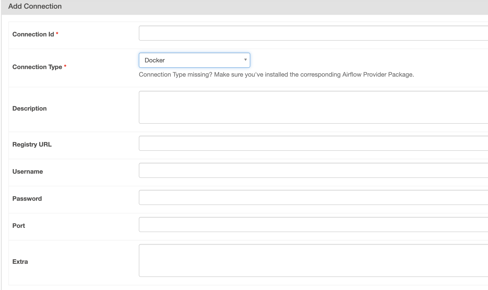

## DockerOperator

이번 장 마지막 summary에 아래와 같은 언급이 있다.

> Some people prefer to rely on generic operators such as the built-in Docker-
Operator and the KubernetesPodOperator to execute their tasks. An advantage
of this approach is that you can keep your Airflow installation lean, as Airflow is
only coordinating containerized jobs; you can keep all dependencies of specific
tasks with the container. We’ll focus on this approach further in a future chapter.

그렇다. 큰 규모로 airflow가 운영될 때 여러 사람이 DAG을 작성한다면
인프라 관리자는 누가 무슨 패키지를 사용할 줄 알고 의존성을 일일이 관리하겠나.
"도커로 만들어서 DockerOperator 사용해주세요." 라는 부탁 한마디면 마법처럼 일이 줄어든다. (아니다.)
뒤이은 챕터에서 다룰 것 같기도 하지만, 일단 먼저 DockerOperator를 간단하게 살펴보고자 한다.


### DockerOperator 생성자
[문서](https://airflow.apache.org/docs/apache-airflow-providers-docker/stable/_api/airflow/providers/docker/operators/docker/index.html)에 따르면 현재 2.5.2 버전의 DockerOperator 생성자 시그니처는 아래와 같다. docker-py를 통해 지원되는 여러 docker run 옵션들이 지원되는 것으로 보인다.

```
DockerOperator(
    image, api_version=None, command=None, container_name=None,
    cpus=1.0, docker_url='unix://var/run/docker.sock', environment=None,
    private_environment=None, force_pull=False, mem_limit=None, host_tmp_dir=None,
    network_mode=None, tls_ca_cert=None, tls_client_cert=None, tls_client_key=None,
    tls_hostname=None, tls_ssl_version=None, mount_tmp_dir=True, tmp_dir='/tmp/airflow',
    user=None, mounts=None, entrypoint=None, working_dir=None, xcom_all=False,
    docker_conn_id=None, dns=None, dns_search=None, auto_remove=False, shm_size=None,
    tty=False, privileged=False, cap_add=None, extra_hosts=None, retrieve_output=False,
    retrieve_output_path=None, **kwargs
)
```

몇 가지 짚어보자면 아래와 같다.

 - 아래 argument들은 templated fields로 정의된다.
   - *image, command, container_name, environment*
 - *mounts*의 경우 [`docker.types.Mount`](https://docker-py.readthedocs.io/en/stable/api.html#docker.types.Mount)를 입력받는다고 적혀있다.
   - docker-py의 [APIClient.create_host_config](https://docker-py.readthedocs.io/en/stable/api.html#docker.api.container.ContainerApiMixin.create_host_config)의 문서에 적힌 내용을 참조한 것 같다.
   - 실질적으로는 아래와 같이 list of string도 받을 수 있는 것으로 보인다.
        ```python
        DockerOperator(
            ...
            mounts=['/mount/path', '/host/path:/container/path']
        )
        ```
    - docker-py의 여러 container 생성 관련 method에서는 `binds` 옵션을 제공하는데, DockerOperator의 init argument에서는 찾아볼 수 없다. 아마 위 예제에서 처럼 mount 옵션을 통해서도 처리할 수 있기 때문이지 않을까.
 - 커맨드 실행시 발생하는 stdout을 xcom에 푸시하는데, 기본적으로는 마지막 line을 push 한다. *xcom_all=True*로 세팅한다면 모든 stdout을 xcom에 푸시한다.
   - 아마 *execute* 메소드에서 stdout을 return하는 모양이다.
 - *retrieve_output_path (str)*, *retrieve_output (bool)* 설정을 통해서 컨테이너 안에서 덤프된 결과들을 pickle 해서 xcom으로 푸시할 수 있는 것 같다.


### Docker connection
다른 외부 서비스들과 마찬가지로 도커 역시 connection을 별도로 관리할 수 있다. 기본 airflow에는 포함되지 않은 것 같고
`apache-airflow-providers-docker`를 설치해야 하는 것으로 보인다. 아래 캡쳐처럼 connection과 관련된 정보들을
관리할 수 있는데, docker-py의 [DockerClient.login](https://docker-py.readthedocs.io/en/stable/client.html#docker.client.DockerClient.login) 메서드에서 필요한 정보들을 기입하는 것으로 보인다.




### DockerOperator with GCR
CI나 다른 인프라를 통해서 도커를 사용할 때 마다 private registry의 인증과 관련된 문제에 부딪히게 된다.
GCR의 경우 보통 private service account를 생성해서 해당 계정의 json key 파일을 사용하는데, airflow에서도 마찬가지인 듯하다.
stack overflow의 [한 답변](https://stackoverflow.com/questions/58733579/airflow-pull-docker-image-from-private-google-container-repository)을 살펴보면 아래처럼 Username을 *_json_key* 로,
Password를 해당 json key file의 내용을 카피해 넣으면 되는 것 같다.
물론 서비스 계정 authentication 이전에 docker가 gcr을 인식할 수 있도록 configure하는 과정이 필요하다.
관련된 정보는 [google cloud의 문서](https://cloud.google.com/container-registry/docs/advanced-authentication?hl=ko)를 통해서 확인할 수 있다.


### DockerOperator with Airflow deployed by docker-compose
docker-compose를 사용해서 airflow 자체를 도커 환경에서 구동하는 경우 docker operator를 사용하기 위해 별도 세팅이 필요할 것이다.
airflow container 안에서 docker daemon을 인식할 수 있어야 하기 때문이다.
가장 쉬운 방법은 container 실행 시 host의 `/var/run/docker.sock`을 바인딩하는 방법인데, [이런 방식](https://github.com/fclesio/airflow-docker-operator-with-compose/blob/main/docker-compose.yaml#L59)으로 세팅이 가능하다.
경우에 따라 permission 때문에 에러가 발생하는데, 개인적으로는 `/var/run/docker.sock`의 권한 변경을 통해 문제를 해결해왔다. 바람직한 방법인지는 잘 모르겠다.
