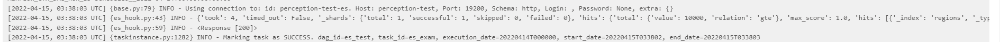

# 이제는 흔한 크래쉬...
책의 docker예제는 놀랍지도 않게도, 또 작동하지 않는다. 주요한 원인은
 - jinja2의 escape를 사용하는 코드가 있는데, jinja2에서 2022년 3월부로 escape이 빠져서, import error 발생
 - 그걸 해결해도 또 다른 import error가 수두룩 발생
 - Flask나 jinja2의 설치 버전을 바꿔도 또 다른 문제가 발생
 - 결국 실행은 포기했다...
따라서, 책의 내용을 따라가면서 문제가 생기는 부분을 해결하면서, 책과 다른 부분을 point out 하는 것이 의미가 있다고 판단되었다. 물론, 위의 문제는 Flask쪽에서 발생된 것에 가까우므로 적지 않고, airflow와 관련된 문제들만 적기로 한다.

## BaseHook class는 이제 `airflow.hooks.base` 에 있다
책에서는
```python
from airflow.hooks.base_hook import BaseHook
```
이라고 말하고 있지만 **deprecated**되었으며, deprecated 된지 오래된 것인지, 이제는 BaseHook 클래스를 찾을 수 조차 없다. 따라서
```python
from airflow.hooks.base import BaseHook
```
에서 임포트 해야 한다.

## BaseOperator는 `airflow.models.baseoperator`에서 찾을 수 있다.
`airflow.models.BaseOperator`가 아니다!

## UI로 connection을 등록할 때 Elasticsearch는 http로 connection type을 설정하면 test fail한다.
 - 405:Method Not Allowed를 마주치게 된다.
 - 그런데 이상한 점은, UI에서만 http가 막혀있고, custom hook/operator에서 http를 통해서 데이터를 받아오는 것은 아무런 문제가 되지 않는다.


# CustomHook/CustomOperator 생성 및 실행 성공 보고
 - script폴더에서 script 확인 가능!
 - es_example.py는 DAG, es_hook_operator/es_hook_operator.py는 hook과 operator를 담고 있다.

