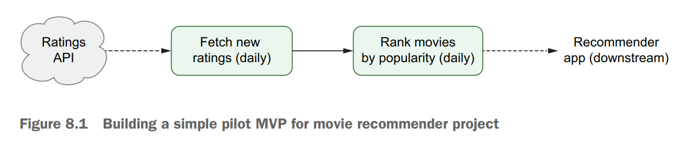
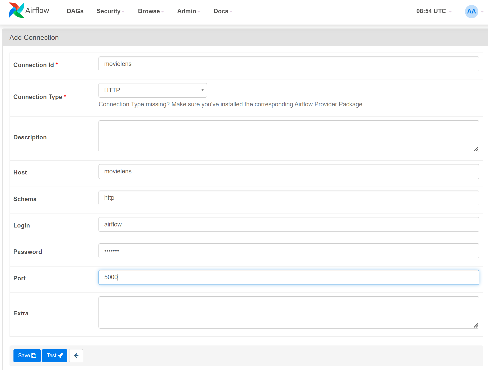

# Building Custom Components

앞선 챕터에서 봤듯이, Airflow에서 지원하는 다양한 Operator들을 사용하여 외부 시스템들을 활용해 워크플로우를 작성할 수 있다.
하지만 Airflow에서 모든 시스템을 지원하는 것은 아니기 때문에, 이를 위해서 직접 Operator 등을 구현하는 방법을 알아본다.

### Key takeaways
* Custom Component를 이용한 DAG 모듈화
* Custom Hook, Custom Operator, Custom Sensor 설계 및 구현하기
* Custom Component를 파이썬 라이브러리로 배포하는 방법

이번 챕터에서는 영화 추천 프로젝트에 대한 간단한 예제를 `PythonOperator`로 작업해본 후, 이를 모듈화 하고 재활용 가능하도록 하기 위해 단계적으로 custom component 들을 작성한다.

## 예제 워크플로우 및 API
주어진 영화 평점 API를 이용해서 일별로 평점 데이터를 가져오고, 인기 영화 랭킹을 생성하는 워크플로우를 아래와 같이 만들고자 한다.


### API 개요
* [MovieLens](https://grouplens.org/datasets/movielens) 데이터셋을 활용한 REST API 서버
    * Custom component를 작성하여 사용할 외부 시스템
* `/ratings` endpoint를 통해 평점 데이터 추출 가능
* endpoint 접근을 위해 username과 password가 제공되어야 함 (airflow/airflow)
    * username: airflow, password: airflow
* 반환하는 데이터 형태는 JSON
    * `result`: 평점 데이터
    * `offset`: 몇번째 결과부터 가져올 지
    * `limit`: 한번에 데이터를 몇개 가져올 지
* `start_date`와 `end_date` 파라미터를 이용하여 주어진 날짜 사이의 데이터를 가져올 수도 있다.

예시:
```bash
http://localhost:5000/ratings?offset=100
```
```bash
http://localhost:5000/ratings?limit=1000
```
```bash
http://localhost:5000/ratings?start_date=2019-01-01&end_date=2019-01-02
```

## Starting with PythonOperator
### Retrieving data from the API
PythonOperator를 사용해서 DAG를 작성해 앞서 나온 workflow를 구현해보자.
API 접근을 위해 `requests` 라이브러리의 `Session`을 사용해야 한다.
```python
import requests

session = requests.Session()
# Simple GET request
response = session.get("http://localhost:5000/ratings")
# GEt request with parameters
response = session.get(
    "http://localhost:5000/ratings",
    params={
        "start_date": "2019-01-01",
        "end_date": "2019-01-02",
    },
)
```
하지만 우리의 API는 사용자 이름과 패스워드로 인증을 요구하므로 session에 인증정보를 설정하고 요청을 보내야 정상적으로 처리된다.
```python
session = requests.Session()
session.auth = ("airflow", "airflow")
```

이제 실제로 GET request를 보내서 데이터를 fetch 해오는 함수(`_get_ratings`) 를 구현해서 데이터를 가져올 수 있다. 구현 디테일은 [코드를 참조.](https://github.com/BasPH/data-pipelines-with-apache-airflow/blob/master/chapter08/dags/01_python.py#L25https://github.com/BasPH/data-pipelines-with-apache-airflow/blob/master/chapter08/dags/01_python.py)

### Building a DAG
정의된 `_get_ratings` 함수를 부르는 PythonOperator를 사용하여 DAG를 구성할 수 있다.
주어진 간격마다 평점 데이터를 가져오고, 데이터를 JSON 파일로 dump하는 `fetch_ratings`를 아래와 같이 정의할 수 있다.
```python
def _fetch_ratings(templates_dict, batch_size=1000, **_):
    start_date = templates_dict["start_date"]
    end_date = templates_dict["end_date"]
    output_path = templates_dict["output_path"]

    # Fetch data
    ratings = list(
        _get_ratings(
            start_date=start_date, end_date=end_date, batch_size=batch_size
        )
    )

    # Make sure output directory exists.
    output_dir = os.path.dirname(output_path)
    os.makedirs(output_dir, exist_ok=True)

    with open(output_path, "w") as file_:
        json.dump(ratings, fp=file_)

fetch_ratings = PythonOperator(
    task_id="fetch_ratings",
    python_callable=_fetch_ratings,
    templates_dict={
        "start_date": "{{ds}}",
        "end_date": "{{next_ds}}",
        "output_path": "/data/python/ratings/{{ds}}.json",
    },
)
```
워크플로우에 나온대로, 평점 데이터를 가져온 후 영화 랭킹을 매기는 `rank_movies` 태스크를 추가할 수 있다. 외부 시스템 필요없이 순수 파이썬 코드이며, 이번 챕터에서 크게 중요하지 않으니 문서에서는 생략하겠다. [(코드 참조)](https://github.com/BasPH/data-pipelines-with-apache-airflow/blob/master/chapter08/dags/custom/ranking.py)

결과적으로 정의된 DAG를 매일 수행되게 함으로써 일별 인기 영화 랭킹을 만드는 workflow를 실행할 수 있다.

## Building a Custom Hook
영화 평점 API를 사용하기 위해서 연동을 위한 코드를 꽤 많이 작성해야 했다.
혹시나 해당 API가 다른 곳에서도 쓰여야 한다면 매번 작성하기 번거로울 것이다.
이를 Airflow Hook으로 만든다면, 필요할 때 마다 hook을 재사용하여 코드 작성을 줄일 수 있다.
또한, hook을 사용하면 Airflow 메타스토어와 UI를 이용해서 credential (Connection) 을 관리할 수 있다.

### How to define a custom hook
* 모든 hook은 Airflow의 BaseHook 클래스를 상속하여 구현한다.
* Hook에서 사용하기 위한 파라미터(대체로 conn_id)를 설정해주기 위한 `__init__` 메소드를 정의한다.
* 대체로 `get_conn` 메소드를 정의하게 되는데, 이 메소드에서 외부 시스템과의 연결을 관리한다.

예제에서는 영화 평점 API에 접근하기 위한 인증을 `get_conn`에 구현한다.
```python
class MovielensHook(BaseHook):
    def __init__(self, conn_id):
        super().__init__()
        self._conn_id = conn_id
    
    def get_conn(self):
        session = requests.Session()
        session.auth = (USER, PASSWORD)

        schema = SCHEMA
        host = HOST
        port = PORT

        base_rul = f"{schema}://{host}:{port}"

        return session, base_url        
```

### Using Connection to manage credentials for Hooks
위와 같이 구현하게 되면, 코드 상에서 인증 정보를 하드코딩 하게 되는데, 보안을 위해서 Airflow 메타스토어에서 관리하는 것이 좋다.
이를 위해서 사용하는 것이 Connection이다.
Airflow에서 Connection을 관리할 수 있는 방법들을 앞선 챕터들에서 언급을 했는데, 여기서는 UI를 통해서 진행하는 방법 위주로 설명한다.

Admin > Connections 로 들어가면 위와 같은 화면을 볼 수 있고 정보들을 입력 후 Connection을 저장할 수 있다.
* Connection Id: Connection을 가져오기 위해서 사용할 `conn_id`
* Connection Type: 서비스 타입 (e.g. AWS, Docker, etc.)
* 그 외의 것들은 Type에 따라 다르다
    * HTTP의 경우 host, port, username, password 등을 지정한다.

설정된 Connection을 접근하려면 BaseHook 클래스에서 제공하는 `get_connection` API에 `conn_id` 값을 넘겨주면 된다.
기본값들을 클래스 내에 정의해서 사용자가 직접 Connection을 생성하지 않더라도 처리할 수 있도록 구현하거나, 설정이 안 되어 있을 때 Exception을 발생시키는 등 다양한 구현이 가능하다.
```python
def get_conn(self):
    config = self.get_connection(self._conn_id)
    schema = config.schema or self.DEFAULT_SCHEMA
    host = config.host or self.DEFAULT_HOST
    port = config.port or self.DEFAULT_PORT
    
    # ... 생략
```

NOTE: 매번 connection을 가져오기 위해 Airflow 메타스토어에 접근하는 오버헤드를 줄이기 위해 클래스 내에 캐싱을 하는 방법도 있다.

마지막으로, `get_conn` 메소드를 이용해 `get_ratings` 메소드를 훅에 구현해서 hook 자체만으로 평점 정보를 가져오는 것까지 구현할 수 있다. ([코드 참조](https://github.com/BasPH/data-pipelines-with-apache-airflow/blob/master/chapter08/dags/custom/hooks.py))

### DAG with MovielensHook
Hook을 이용해 [앞서](./summary.md#building-a-dag) PythonOperator만으로 정의한 `fetch_ratings` 오퍼레이터를 조금만 수정해서 DAG를 정의할 수 있다.
* `MovielensHook` 오브젝트를 생성하여 `get_ratings`를 호출하도록 변경
* PythonOperator에 Python Callable을 넘겨주면서 `op_kwargs`를 같이 전달하여 `conn_id`를 넘겨준다. `conn_id`는 hook 생성시 사용 된다.
    * 혹은, default 값을 설정 해두고 그 값을 사용하게 할 수도 있다.

## Building a Custom Operator
Hook을 이용해서 인증에 대한 부분을 캡슐화하긴 했지만, 여전히 PythonOperator를 이용해 코드들을 꽤 작성해야한다.
이를 최소화 하기 위해서 커스텀 오퍼레이터를 구현할 수 있다.

### How to define a Custom Operator
* 모든 오퍼레이터는 Airflow의 `BaseOperator`를 상속해야한다.
* `apply_defaults` 데코레이터로 `__init__` 메소드를 wrapping하여 DAG의 `default_args` 파라미터를 통해 제공되는 값들을 전달한다.
    * `retry_delay`, `task_id` 등 다양한 값들이 포함되며 task를 수행하기 위해 필수적인 것들이 포함된다.
* `execute` 메소드를 정의하여 Operator가 작업할 사항들을 구현한다.
    * `execute` 메소드는 `context`라는 파라미터 하나만 받는데, 이 오브젝트에 모든 context 변수들을 담고 있다.
```python
from airflow.models import BaseOperator
from airflow.utils.decorators import apply_defaults


class MyCustomOperator(BaseOperator):
    @apply_defaults
    def __init__(self, conn_id, **kwargs):
        super.__init__(self, **kwargs)
        self._conn_id = conn_id
        ...
    
    def execute(self, context):
        ...
```

### Custom Operator for fetching ratings with the API
주어진 시작/종료 날짜 사이의 평점 데이터를 가져와 JSON 파일로 저장하는 Operator를 구현하자.

```python
class MovielensFetchRatingsOperator(BaseOperator):
    @apply_defaults
    def __init__(
        self, conn_id, output_path, start_date, end_date, **kwargs,
    ):
    super().__init__(**kwargs)
    
    self._conn_id = conn_id
    self._output_path = output_path
    self._start_date = start_date
    self._end_date = end_date

    def execute(self, context):
        hook = MovielensHook(self._conn_id)

        try:
            ratings = list(
                hook.get_ratings(
                    start_date=self._start_date,
                    end_date=self._end_date,
                )
            )
            
        finally:
            hook.close()
        
        output_dir = os.path.dirname(self._output_path)
        os.makedirs(output_dir, exist_ok=True)

        with open(self._output_path, "w") as file:
            json.dump(ratings, fp=file)
```

사용하는 방법은 일반적인 Operator 사용 방식과 동일하다.
```python
fetch_ratings = MovielensFetchRatingsOperator(
    task_id="fetch_ratings",
    conn_id="movielens",
    start_date="2020-01-01",
    end_date="2020-01-02",
    output_path="/data/2020-01-01.json",
)
```

더 나아가서, 시작/종료 날짜를 template 기능을 통해 넣어주고 싶을 수 있다.
그렇게 하기 위해서는 Operator클래스 정의 시, `template_fields`에 템플릿화할 변수들을 명시해서 Airflow에 알려줘야 한다.

```python
class MovielensFetchRatingsOperator(BaseOperator):
    ...
    template_fields = ("_start_date", "_end_date", "_output_path")
    ...

    @apply_defaults
    def __init__(...):
        ...
```
이렇게 알려주고 나면, Airflow에서 `execute` 메소드 호출 전에 값들을 템플릿화하여 전달해준다.
```python
fetch_ratings = MovielensFetchRatingsOperator(
    task_id="fetch_ratings",
    conn_id="movielens",
    start_date="{{ds}}",
    end_date="{{next_ds}}",
    output_path="/data/custom_op/{{ds}}.json"
)
```

## Building Custom Sensor