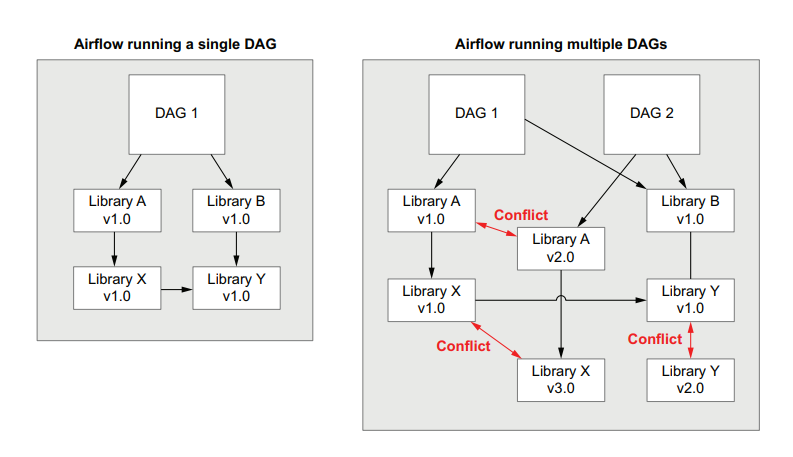
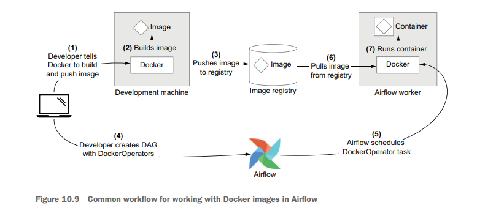

# Task를 컨테이너 안에서 돌리기

## Previously on DDAA
전 챕터에서까지는 각 task에 걸맞는 여러 Airflow operator를 이용해서 DAG들을 써왔다.

## 많은 종류의 operator를 사용할 때의 문제
그러나, 여러 종류의 Operator를 한꺼번에 사용하게 되면, Airflow에서 돌리는 작업의 복잡성이 커져감에 따라 문제가 발생하게 된다.

### 개발자의 각 Operator 이해도 저하
 - 여러 오퍼레이터들을 다 사용하는 방식이 조금씩 다르다.("arguments", "template 가능한 필드의 종류", "hook 사용법" 등...)
 - 익숙해 지는데 시간이 많이 걸리고,
 - 사용 방식이 조금씩 다르기에, 디버깅을 함에 있어 원인을 분석하는 데 더 많은 시간이 소요될 수 있음(오퍼레이터에 대한 정보를 다시 찾아봐야하기 때문에).

### 복잡하고, 충돌하는 의존성들
 - 각 오퍼레이터들은 같은 라이브러리라고 하더라도, 사용해야 하는 버전이 다를 수 있다.
 - DAG에서 사용하는 Operator들의 갯수가 많아지고, 복잡해질 수록, 머신에 설치되어 있는 라이브러리 간의 충돌이 일어날 수 있다.



### 결론: 하나의 범용적인 오퍼레이터를 사용하자 - 도커/쿠버네티스

## 컨테이너란? (설명과 도커를 사용한 예제)
이미 대부분 알고 계시기에, 과감하게 생략하였다

## 컨테이너와 Airflow
Airflow에서 컨테이너를 사용하는 방법과, 장점에 대해 다룬다.

### 컨테이너 안의 task들
 - 각 task들을 DockerOperator/KubernetesPodOperator를 사용해 정의하고 실행하자
 - 사용하는 operator는 같고, 사용하는 docker image/pod만 변경된다!

### 왜 컨테이너를 사용해야하는가?
#### 쉬운 패키지 의존성 관리
 - 여러 오퍼레이터들이 동시에 사용될 때 생길 수 있는 패키지 의존성 문제에서 자유롭다. 실제로 사용하는 것은 컨테이너 실행 오퍼레이터인 DockerOperator/KubernetesPodOperator 뿐이기 때문이다.

#### 개발자의 Airflow development burden 경감
 - DockerOperator/KubernetesPodOperator만 사용하기 때문에, 개발자가 DAG를 개발함에 있어 훨씬 나은 경험(속도/이해도)을 하게 해줄 수 있다.

#### 더 나은 test
 - 앞장까지는 airflow의 task 별 수행 logic도 기술되어 있었기에, orchestration 뿐 아니라, task 별 수행 logic도 test를 해야만 했다.
 - 그러나, Docker를 사용하게 됨으로써, 실행 로직은 airflow에서 완전히 독립하게 되고, 실행 로직은 각 Docker를 생성한 repo에서 테스트하면 된다.
 - 즉, Airflow가 Orchestration에만 집중할 수 있게 되는 것이다!
 - 사족: 여러 장에 걸쳐 나왔지만, 저자는 Airflow가 Orchestration에만 집중하는 것을 더 나은 Airflow 사용법이라고 보고 있다.

## 도커에서 Task들을 돌리기
### DockerOperator의 세계로~
#### 설치 방법
```bash
$ pip install apache-airflow-providers-docker
```

#### 사용 예
```python
    rank_movies = DockerOperator(
        task_id="rank_movies",
        image="manning-airflow/movielens-rank",
        command=[
            "rank-movies",
            "--input_path",
            "/data/ratings/{{ds}}.json",
            "--output_path",
            "/data/rankings/{{ds}}.csv",
        ],
        volumes=["/tmp/airflow/data:/data"],
    )
```
 - parameters:
    - image: image 이름/tag
    - command: image에서 실행시킬 command
    - volumes: mount 시킬 volume 설정

### DockerOperator에서 실행시키기 위한 docker image 만들기
 - Docker Image 만드는 방법은 다들 알고 계시기에 또 과감히 생략하였다..
 - 저자들은 click을 사용하고 있지만, 발제자는 fire를 선호합니다!
 - Click 써보신분?!
 - argsparse는 실행 전에 써줘야 할 arguments 와 관련된 script가 너무 많다...
 - Click도 보아하니 decorator를 쓰면서 귀찮기는 마찬가지인것 같다...
 - fire는 이에 비해 fire.Fire(실행시킬 클래스 or function)이름을 적어주면 되서 너무 간단하다!
 - fire에서 실행되는 method/function의 parameter를 CLI에서 쉽게 넘겨줄 수 있다.

### DockerOperator를 이용해서 DAG 만들기
 - DockerOperator도 나머지 오퍼레이터들과 다름없이 task dependencies를 설정할 수 있다.
 - Airflow에서는 Docker image에서 실행되며 나온 로그들을 확인할 수 있다.

### Docker 기반 workflow


1. 도커 이미지 빌드 및 이미지를 image registry에 푸쉬
2. DAG 생성
3. Airflow가 스케쥴 생성
4. Airflow worker가 이미지 pull
5. Airflow worker가 이미지에서 task의 command 실행

## Kubernetes에서 task 돌리기
 - Docker은 한 개의 머신에서 container를 돌리기에 좋은 방법이다.
 - 그러나, 여러 머신을 이용해 docker를 돌려야 하고, 그것들을 조율하는 일은 Kubernetes를 통해야 한다.

### Kubernetes란?
 - 여러 컨테이너들을 여러 머신에 배포하고, 그것들을 조율하는 역할을 할 수 있다.
 - 비밀 키와 storage management 등도 가능하다.
 - kubectl라는 CLI interface나 Kubernetes Python SDK를 사용해 Kubernetes를 이용할 수 있다.
 - Kubernetes에서 가장 작은 단위는 **pod**이다.

### Kubernetes로 세팅하기
1. Kubernetes namespace 생성
2. yaml로 storage 정의
3. kubectl로 storage 생성 및 배포

 - API를 위한 세팅
4. API 설정(docker image 세팅 등) yaml 생성
5. kubectl을 이용해 API 배포

### KubernetesPodOperator 사용하기
#### 설치 방법
```bash
$ pip install apache-airflow-providers-cncf-kubernetes
```

#### 사용 예제
```python
    volume_claim = k8s.V1PersistentVolumeClaimVolumeSource(claim_name="data-volume")
    volume = k8s.V1Volume(name="data-volume", persistent_volume_claim=volume_claim)

    volume_mount = k8s.V1VolumeMount(
        name="data-volume", mount_path="/data", sub_path=None, read_only=False
    )

    rank_movies = KubernetesPodOperator(
        task_id="rank_movies",
        image="manning-airflow/movielens-rank:k8s",
        cmds=["rank-movies"],
        arguments=[
            "--input_path",
            "/data/ratings/{{ds}}.json",
            "--output_path",
            "/data/rankings/{{ds}}.csv",
        ],
        namespace="airflow",
        name="rank-movies",
        cluster_context="docker-desktop",
        in_cluster=False,
        volumes=[volume],
        volume_mounts=[volume_mount],
        image_pull_policy="Never",
        is_delete_operator_pod=True,
    )
```

 - parameters:
    - image: 사용할 도커 이미지
    - cmds: 이미지에 사용할 커맨드
    - arguments: 커맨드에 넘겨줄 아규먼트
    - volumes & volume_mounts: Kubernetes의 storage에 연결하고 pod내에 마운트

### kubernetes based workflow


대부분은 docker based workflow와 비슷하지만 차이가 있다.
1. DockerOperator에서는 Airflow worker가 image 실행의 주체이나, Kubernetes쪽에서는 Kubernetes cluster가 image 실행의 주체이다. --> airflow worker의 역할이 줄어듬
2. DockerOperator에서는 직접 볼륨을 생성하고 연결하는 것이 가능했지만, Kubernetes쪽에서는, airflow에서 볼륨 생성이 불가능하고, Kubernetes client를 이용해서 만들어야한다.


---
---
---
# 사족: Helm chart를 이용한 Airflow deloy
 - 예전에 언급한 적이 있지만, airflow를 docker-compose를 통해 up하는 것은 지양되는 것으로 보인다.. 세팅해야 할 것이 너무 많기도 하지만, 더 좋은 방법이 존재하기 때문이다. 바로 Helm chart를 이용한 deploy이다.

## Helm chart?
kubernetes package manager! 쉽게 쿠버네티스를 관리할 수 있다!

## Airflow와 Helm chart
2021년 중반에 공식 Airflow Helm chart가 배포되었다. 안타깝게도, 우리의 책은 2020년도에 지어졌으므로, 공식 Airflow Helm chart에 대해서는 기술하지 않는다!

## Airflow Helm chart에서의 DAG 관리: Dockerize Dags!
[How to manage Dags on Airflow Helm chart](https://airflow.apache.org/docs/helm-chart/stable/manage-dags-files.html)

- DAG를 Kubernetes의 Airflow에 어떻게 삽입할 것인가? 여러방법이 있지만, Docker image를 사용하는 방법이 가장 깔끔해 보인다.

    1. DAG를 담은 Docker image를 빌드 한다.
    ```bash
    $ docker push my-company/airflow:8a0da78

    ```
    2. helm을 통해 해당 airflow DAG Docker image를 연결해 준다.
    ```bash
    $ helm upgrade --install airflow apache-airflow/airflow \
        --set images.airflow.repository=my-company/airflow \
        --set images.airflow.tag=8a0da78
        --set images.airflow.pullPolicy=Always
    ```

## 참고 자료
 - [Airflow helm chart](https://airflow.apache.org/docs/helm-chart/stable/index.html)
 - [How to start with Airflow helm chart by Data with Marc](https://www.youtube.com/watch?v=GDOw8ByzMyY&t=603s)

# 사족: Docker image의 아웃풋을 xcom으로 가져오기
Operator에서 `xcom_all=True`를 세팅하면, 모든 output log가 xcom으로 들어가게 된다.
```python
    rank_movies = DockerOperator(
        task_id="rank_movies",
        image="manning-airflow/movielens-rank",
        command=[
            "rank-movies",
            "--input_path",
            "/data/ratings/{{ds}}.json",
            "--output_path",
            "/data/rankings/{{ds}}.csv",
        ],
        volumes=["/tmp/airflow/data:/data"],
        xcom_all=True
    )
```

그러나, 만약 하나가 아닌 여러개의 return을 받아야 할 경우에는, 그리고 여러개의 output log가 남는 경우에는, `retrieve_output=True` , `retrieve_output_path={output path}'를 통해 받을 파일을 세팅하고, output file은 pickle 파일로 보내주는 것이 권장된다.

## 예제:
 - Airflow side
```python
t2 = DockerOperator(
    task_id='t2',
    image='hell_image:v1.2.3',
    command='python hello_world.py'
    retrieve_output=True,
    retrieve_output_path='/tmp/test.file'
)
```

 - Docker side
```python
...
with open('/tmp/test.file', 'wb+') as tmp_file:
    pickle.dump({'flag': False}, tmp_file)
...

```

이렇게 세팅하면, {'flag': False}가 Xcom에 들어가게 된다!


