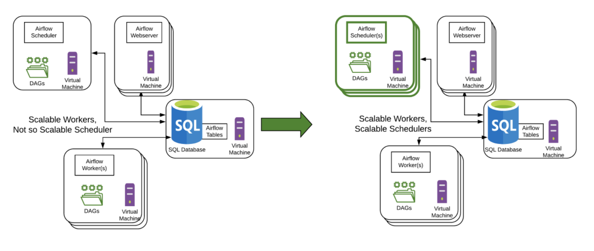
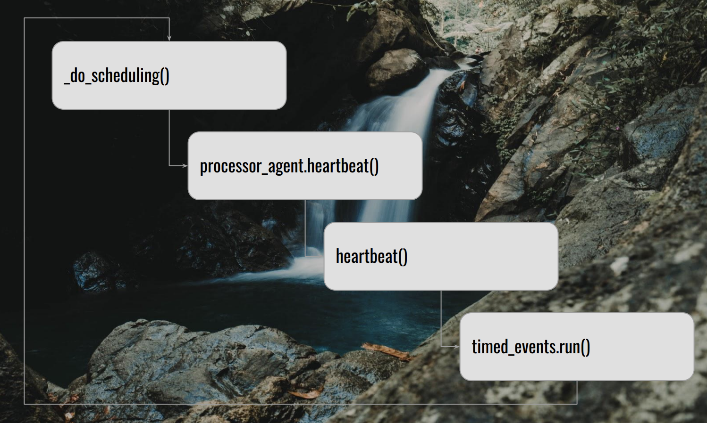
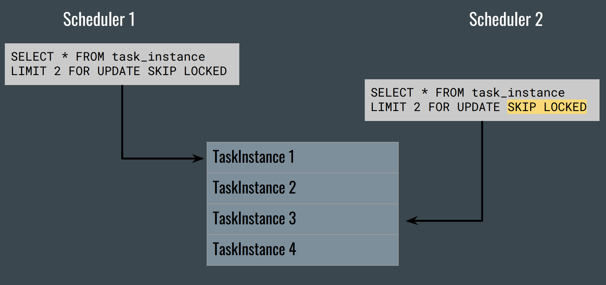

# Brief review on airflow scheduler
전부터 궁금했던 airflow scheduler에 대해서 간략하게 살펴보고 넘어가려고 한다.

## About Airflow 2.0 scheduler - HA Scheduler
먼저 현재 airflow 2.0의 스케쥴러의 특징에 대해 간략히 짚고 넘어가려고 한다.
2019년도 Airflow 1.10.x 버전 운영 당시 설문조사 결과 사용자들이 scheduler에 대해 가장 불만족스럽다고 답했다고 한다.
아래의 왼쪽과 같이, task를 수행하는 worker는 kubernetes, celery 등을 사용하여 scalable하지만 scheduler 자체는 scalable하지 않았다고 한다.
DAG가 늘어날 수록 병목현상이 발생하는 경우가 많았고, 이에 따라 airflow2.0에서는 scheduler를 scalable하도록 개선하는 작업이 이루어졌다.
[Astronomer](https://www.astronomer.io/)에서 이를 주도했고, 업데이트된 multiple & scalable airflow scheduler를 HA (Highly Avaialble) scheduler라고들 부르는 것 같다.



## Scheduler components
Airflow scheduler는 아래와 같은 요소로 구성이 된다.
- SchedulerJob
  - `airflow.jobs.scheduler_job`
  - 실질적으로 스케쥴링을 담당하는 구성 요소로, 일종의 state machine이다.
  - 후술할 executor와 dag file processor를 멤버 변수로 들고 있으며, 각각을 실행 및 관리 한다.
  - dag 스크립트를 직접 읽지 않는다. DAG 테이블에 접근하여 serialize 된 정보만 사용한다.
- Executor:
  - `airflow.executors`
  - SchedulerJob으로 부터 taskinstance를 넘겨받아 실제로 task를 실행한다.
  - KubernetesExecutor, CeleryExecutor, LocalExecutor 등이 있다.
- DagFileProcessor:
  - `airflow.dag_processing`
  - `airflow scheduler` 커맨드의 서브프로세스로 동작
  - DAG 파일을 파싱하여 serialized_dags 테이블에 삽입.
  - DAG 단위의 callback들을 실행.

## SchedulerJob

### SchedulerJob._run_scheduler_loop()
Airflow scheduler의 loop은 아래와 같이 구성이 된다.

1. self._do_scheduling()
   - 실질적인 scheduling 함수
   - 실행 가능한 DAG를 살피고, 각 task instance들을 executor의 queue에 집어넣는다.
2. self.processor_agent.heartbeat()
   - dagfile processor를 실행하는 agent 프로세스의 health check을 한다.
3. self.heartbeat()
   - scheduler process의 heath check를 한다.
4. timers.run()
   - timeout callback 등 timed events를 실행한다.

### SchedulerJob._do_scheduling()
위의 _do_scheduling() 메소드를 아래와 같이 축약할 수 있다.

```python
# _do_scheduling

self._create_dagruns_for_dags()
self._start_queued_dagruns()

dag_runs = self._get_next_dagruns_to_examine(State.RUNNING)

for dag_run in dag_runs:
    self._schedule_dag_run(dag_run)

num_queued_tis = self._critical_section_execute_task_instances()
```

1. self._create_dagruns_for_dags()
   - DAG 테이블에서 실행할 시간이 된 DAG (next_dagrun_create_after < NOW)의 DagRun을 생성한다.
   - DAG 테이블에서 다음 DagRun의 정보를 업데이트한다.
2. self._start_queued_dagruns()
   - 각각의 DagRun은 state 정보를 가지고 있다.
   - 현재 실행중인 DagRun의 수와 max_active_runs 값을 비교하여, 실행 가능한 만큼 DagRun의 state값을 *queued*에서 *running*으로 업데이트한다.
3. self._get_next_dagruns_to_examine(State.RUNNING)
   - *running* state의 DagRun을 가져온다.
4. self._schedule_dag_run()
   - timeout 등 여러 sanity check를 수행하고, DagRun의 TaskInstance 중, 현재 실행 가능한 것들의 상태를 *sceheduled* 로 업데이트한다.
5. self._critical_section_execute_task_instances()
   - scheduled task instance들을 executor의 queue에 집어넣는다.
   - *critical_section* 이란 단어가 붙은 이유는 후술할 scheduler 사이의 자원 접근 제한 때문이다.


### Critical Section and TaskInstance execution

앞서 말했듯, Airflow 2.0에서는 고가용성을 위해 여러 scheduler를 두게 되었다.
이 때 서로 다른 스케쥴러가 같은 task instance에 접근하는 것을 막을 필요가 있는데, 기존의 metastore database에서 TaskInstance 테이블의 각 row에 lock을 거는 방식으로 해결했다고 한다.
대부분의 SQL에서 위와 같은 구문/기능을 지원한다고 한다.
- FOR UPDATE
  - update를 위해 쿼리되는 row들에 lock을 거는 syntax.
- SKIP LOCKED
  - lock이 걸려있는 row들을 쿼리에서 제외하는 syntax

## Resources
- Deep dive in to the Airflow scheduler: [youtube](https://www.youtube.com/watch?v=DYC4-xElccE*), [pdf](https://airflowsummit.org/slides/2021/d2-Scheduler.pdf)
- Airflow 2.0 Series - HA Scheduler - Part 6: [youtube](https://www.youtube.com/watch?v=W1vMCB40NjY)
- The Airflow 2.0 Scheduler: [page](https://www.astronomer.io/blog/airflow-2-scheduler/)