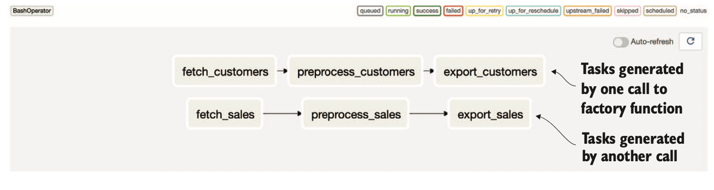
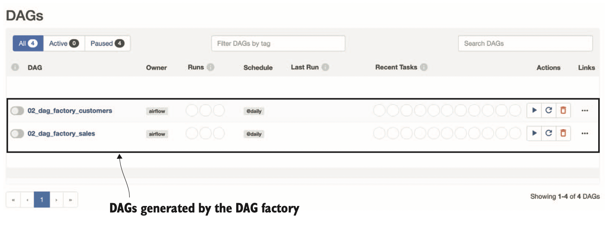
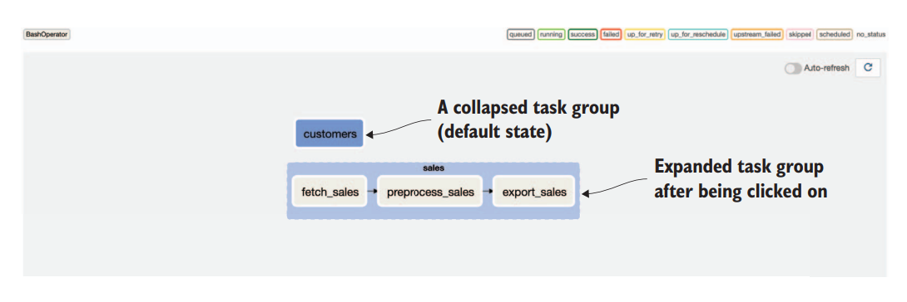
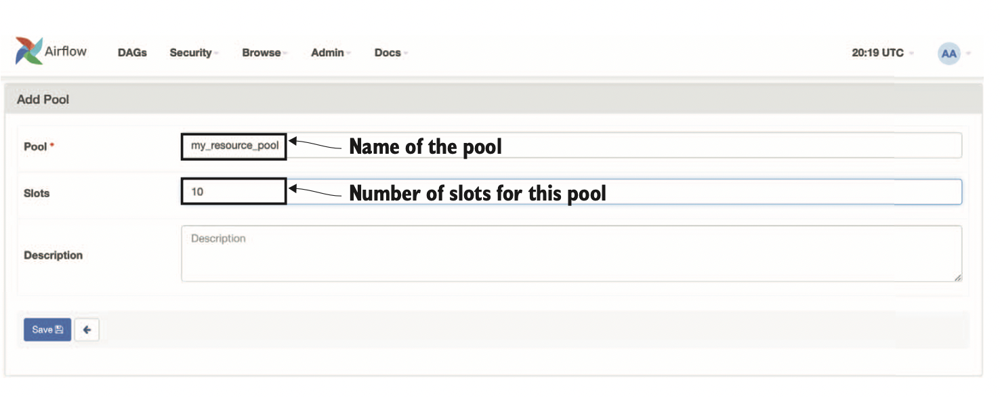

# Best Practices
이번 챕터에서는 Airflow 사용 시 권장되는 best practices들을 간단하게 다룬다.

## Key Points
* DAG 작성 시 스타일 컨벤션을 사용하기
* Credential과 Configuration 관리에 일관된 접근 방식 사용하기
* Factory 함수를 이용한 DAG와 Task 반복 생성
* Idempotent하고 deterministic한 태스크 설계
* 데이터 크기를 제한하여 데이터를 효율적으로 다루기
* 중간 데이터를 관리하고 저장하기 위한 효율적인 방법 사용하기
* 리소스 Pool을 사용한 동시성 관리하기

## Writing Clean DAGs
DAG를 작성하고 수정하게 되면서 DAG는 금방 복잡해지고 가독성이 떨어지게 된다.
DAG 코드를 깔끔하게 작성하기 위한 몇가지 팁을 소개한다.

### 1. 스타일 컨벤션 사용하기
**스타일 가이드를 따르자**. 파이썬 코드를 깔끔하게 작성하는 가장 쉬운 방법은 style guide에 따라서 코드를 작성하는 것이다. PEP8이나 Google 등 회사에서 사용하는 guide를 따르면 된다. 대체로 이런 가이들은 들여쓰기나 라인 길이, 네이밍 스타일 등이 포함된다.


**정적 코드 분석 툴을 사용해서 코드 퀄리티를 체크하자**. 작성한 코드가 올바른 코딩 컨벤션을 지켰는지 체크하기 위한 분석 툴이 존재한다. Pylint와 Flake8이 대표적인데, 코드에 해당 툴들을 적용하면 코드에 대한 리포트를 볼 수 있다. Pylint가 Flake8 보다 더 다양한 검사를 제공하고 있긴 하고, Pylint와 Flake8 둘 다 선호도에 따라서 검사 항목들을 지정할 수 있다.

**Use code formatters**. 정적 분석 툴들이 코드 퀄리티에 대한 검사는 해주지만, 코드 formatting에 대해서는 엄격한 조건이 존재하지 않는다. 일관된 코드 스타일을 적용하기 위해서, formatter를 사용할 수 있다. 널리 쓰이는 Python formatter는 YAPF와 Black이 있고, 선호도에 따라서 골라 적용하면 된다.

**Set Airflow-specific style conventions**. Airflow 코드 작성 할 때, 같은 결과를 내는 서로 다른 코드 스타일에 대해서 팀 내에서 규칙을 정하고 한가지로 통일하면 좋다. 예를 들면, DAG를 정의할 때 context manager를 사용할 것인지 말 것인지, 아니면 task dependency를 정의할 때 `>>`를 쓸 것인지 `set_upstream()` 등을 쓸 것인지가 있을 것이다. 일관된 스타일을 사용하여 혼동이 없도록 해야한다.

### 2. 중앙에서 Credential 관리하기
다양한 외부 시스템과 상호작용하는 DAG가 있다면, 다양한 종류의 credential을 다루게 된다.
Airflow는 credential을 connection store에 저장하여 안전하게 중앙에서 관리할 수 있도록 한다.
Connection store에 쉽게 접근해서 사용할 수 있는 방법이 있어 이를 사용하면 DAG에 credential 정보를 하드코딩 하는 일을 막을 수 있다.
```python
from airflow.hooks.base import BaseHook

def _fetch_data(conn_id, **context):
    # fetch credential with the given ID
    credentials = BaseHook.get_connection(conn_id)
    ...

fetch_data = PythonOperator(
    task_id="fetch_data",
    op_kwargs={"conn_id": "my_conn_id"},
    dag=dag,
)
```
만약 다른 외부 시스템에 secrets를 보관하고 싶을 수도 있지만 그런 경우에도 해당 정보들을 Airflow에 전달하게 해서 (e.g. 환경변수) Airflow의 Connection store를 통해 접근하게 하는 것이 좋다.

FYI: 환경변수를 사용해서 Connection을 관리하는 방법은 [여기](https://airflow.apache.org/docs/apache-airflow/stable/howto/connection.html#storing-connections-in-environment-variables)에 자세히 나와있다.

### 3. Configuration detail을 일관되게 지정하기
DAG에 다양한 설정 정보 (e.g., 파일 경로, 테이블 이름 등)를 넘겨야 할 때가 있다.
파이썬 특성 상, 이러한 설정 정보를 글로벌 변수를 사용하거나, 설정 파일을 사용거나, 환경 변수를 사용하기 등을 통해 지정할 수 있다. Airflow 자체적으로도 metastore에 설정 정보를 저장할 수 있는 방법이 있다: [Variables](https://airflow.apache.org/docs/apache-airflow/stable/concepts/variables.html)를 사용하는 것이다.
```python
from airflow.models import Variable

input_path = Variable.get("input_path")
output_path = Variable.get("output_path")

fetch_data = PythonOperator(
    task_id="fetch_data",
    op_kwargs={
        "input_path": input_path,
        "output_path": output_path,
    }
    ...
)
```
이렇게 설정 정보를 관리하기 위해서 Variable을 사용할 수도 있고, YAML등 파일을 이용해서 해도 된다. 하지만 어떤 방식을 사용하든 한 가지 방법을 일관되게 사용하는 것이 좋다.
만약 다수의 DAG들이 공유하는 설정값들이 존재한다면, 꼭 한 곳에서 정의해서 변경사항이 생겼을 때 놓치는 경우가 없게 해야 한다.

한가지 명심해야 할 것은 설정값 loading은 실제로 사용되는 context에서 하는 것이 좋다.
위의 예제나 아래 예제에서처럼 global scope에서 진행하게 된다면 스케줄러가 불필요하게 로딩을 진행하게 되어서 비효율적일 수 있다.
```python
import yaml

with open("config.yaml") as config_file:
    config = yaml.load(config_file)

fetch_data = PythonOperator(...)
```
반면에 task 내부에서 로딩을 진행하게 된다면 Airflow worker만 태스크 실행시 설정을 로딩 할 것이다.
하지만 이런 경우에는 Airflow worker의 환경에서 설정 파일을 찾게 될텐데 이 경우 예기치 못한 에러가 발생할 수 있다.
따라서 한가지 방식을 정해서 DAG 들이 정보를 가져갈 수 있게 해야하고, 모든 Airflow component들이 접근 가능한 방식 (파일의 경우 공유 스토리지를 사용하는 등)을 사용해야 한다.

### 4. DAG 정의에서 computation을 지양하기
DAG를 파이썬 파일로 작성하고 해당 DAG를 인식하기 위해서 Airflow는 파일을 실행하고, 변경사항이 있는 경우를 인식하기 위해서 규칙적으로 재실행을 한다.
DAG 파일들을 반복적으로 실행하기 때문에 긴 시간이 걸리는 함수가 존재한다면 문제가 생길 수 있다.
```python
task1 = PythonOperator(...)
my_value = do_some_long_computation()
task2 = PythonOperator(op_kwargs={"my_value": my_value})
```
위와 같은 구현은 `do_some_long_computation()` 함수가 DAG 파일 로드 시에 매번 실행되게 할 것이고, DAG parsing을 방해한다.
해결책은 긴 computation이 반환한 값을 필요로하는 task 내에서 수행하도록 하는 방법이 있다.

Computation 뿐만 아니라, Connection store로부터 credential을 가져올 때나, 파일 시스템/클라우드 스토리지에서 설정값들을 불러오는 것도 마찬가지이다. DAG 파일에서 직접 실행시켜서 전달해주는 것이 아니라 task내에서 진행하도록 postpone 시켜서 DAG parsing에 영향을 끼치지 않도록 하는 것이 좋다.

### 5. 공통된 패턴에 대해서 Factory 함수를 이용하기
공통된 패턴을 가진 DAG를 여러개 작성하는 경우가 있을 수 있다.
이런 경우 factory function을 사용해서 쉽게 핸들링 할 수 있다.
예를 들어 동일한 데이터 처리 파이프라인이 있고, sales 데이터와 customers 데이터에 각각 적용할 수 있다고 하자.
```python
def generate_tasks(dataset_name, raw_dir, processd_dir,
                   preprocess_script, output_dir, dag):
    ...
    # Create individual tasks
    fetch_task = BashOperator(...)
    preprocess_task = BashOperator(...)
    export_task = BashOperator(...)

    # Define task dependencies
    fetch_task >> preprocess_task >> export_task

    # Return first and last tasks in case those are connected
    # in the larger DAG
    return fetch_task, export_task


with DAG(...) as dag:
    for dataset in ["sales", "customers"]:
        # Create sets of tasks with different configs
        generate_tasks(...)
```

위의 경우는 하나의 DAG에 두가지 종류의 워크플로우가 생성이 된다.
각각 따로 하나씩 DAG를 생성하는 factory function을 사용할 수도 있다.
```python
def generate_dag(dataset_name, raw_dir, processed_dir, preprocess_script):
    with DAG(...) as dag:
        ...
        fetch_task = BashOperator(...)
        preprocess_task = BashOperator(...)

        fetch_task >> preprocess_task

    return dag

for dataset in ["sales", "customers"]:
    # Use globals() to modify global variables in the file.
    # NOTE: If objects have the same variable names, it will be overwritten.
    globals()[f"dag_factory_{dataset}"] = generate_dag(...)
```

이렇게 한 파일로 여러개의 DAG를 생성할 수 있지만, 혼란을 가져오는 경우도 있으니 최대한 지양하는 것이 낫다.
이러한 factory 방식은 다양한 설정 파일들이 존재하고, 이 파일들의 정보를 기반으로 DAG를 생성하고자 할 때 유용하다.

### 6. 관련된 Task들을 Task group으로 묶기
Task 수가 아주 많거나 복잡한 DAG를 다룰 때 task group을 사용해서 시각적으로 task 들을 grouping하면 전체적인 흐름을 쉽게 파악하게 할 수 있다.
Airflow 2에서 도입외었으며, `TaskGroup` 컨텍스트 매니저를 이용해서 사용 가능하다.
Factory function 예제를 예로 들면 아래와 같다.
```python
for dataset in ["sales", "customers"]:
    with TaskGroup(dataset, tooltip=f"Tasks for processing {dataset}"):
        generate_tasks(...)
```


### 7. 큰 변경이 있을 때는 새로운 DAG를 생성하기
DAG의 스케줄에 변경을 가하거나, 태스크 이름을 변경하는 등 큰 수정사항이 생기면, 과거의 DAG 실행들과 매치가 안 되기 때문에 스케줄러에 혼란을 줄 수 있고, DAG의 state 들에 더이상 접근이 불가 할 수 있다.
이러한 불상사를 막기 위해서는 큰 수정사항이 있을 때는 새로운 DAG를 생성해서 과거의 DAG 실행 기록들을 유지할 수 있도록 하는 것이 좋다.
아쉽게도 아직도 versioned DAG 기능은 WIP이다. [Proposal](https://cwiki.apache.org/confluence/display/AIRFLOW/AIP-36+DAG+Versioning)

## Designing Reproducible Tasks
### 1. Task들은 항상 idempotent 하도록 한다.
챕터3에서 나왔듯이, "좋은" Airflow task는 idempotent한 것이다.
즉, 해당 태스크를 몇번 돌리든지 똑같은 결과가 나와야 한다.
Idempotency가 중요한 이유는 task를 다시 돌리는 경우가 많기 때문이다. (태스크가 실패해서 다시 돌리거나, 약간의 수정 후 진행하거나, Airflow 자체에서 re-execution을 수행하거나...)
이런 경우에 side effect를 줄이기 위해서는 idempotency를 지켜야 한다.
태스크의 output data가 덮여쓰여지도록 설계하고, 태스크의 부수 효과들을 잘 살펴서 idempotency를 위반하지 않는지 확인해야 한다.

### 2. Task의 결과들은 deterministic 해야한다.
Task의 결과가 deterministic해야만 reproducible 하다고 할 수 있다.
Nondeterministic 한 경우의 예는 아래와 같다:
* 데이터의 순서에 의존하는 경우. (python dict처럼 순서가 보장되지 않는 자료 구조에서 순서에 의존하는 등)
* 함수 외부의 state에 의존하는 경우. 랜덤값을 사용한다던지, 전역 변수를 사용한다던지 등
* 병렬 처리를 한 후 명시적인 ordering을 하지 않는 경우
* Race condition이 있는 코드
* 예외 처리를 잘못 한 경우

태스크가 사용하고 있는 소스들에 대해서 면밀히 살펴봄으로써 위와 같은 상황을 피하는 것이 좋다.

### 3. 함수형 패러다임으로 태스크를 디자인하라.
Task를 함수형 프로그래밍을 이용하여 설계하면 state나 mutable data에 의존하지 않기 때문에 "좋은" task를 디자인 할 수 있다.
아웃풋 외에 다른 부수 효과를 일으키지도 않는다.
특정 인풋에 대해서 항상 동일한 결과물을 반환하고 (deterministic), 즉 idempotent하고 deterministic한 특성을 가진다. 

## Handling Data Efficiently
### 1. 처리되는 데이터 양을 제한하라.
효율적으로 데이터를 핸들링 하는 방법은 최소한의 데이터로 원하는 결과를 얻는 것이다.
데이터의 소스와 요구사항을 면밀히 파악해서 필요하지 않은 데이터들은 배제하고 진행할 수 있는지 보아야 한다.
예를 들면 aggregation이나 filtering이 들어간 워크플로우라면, 해당 태스크를 먼저 수행해서 데이터 크기를 줄일 수 있는 지 살펴보자.

### 2. 점진적으로 loading/processing 하라
데이터를 한번에 처리하지 말고 점진적으로 처리함으로써 한번의 DAG 실행에서 처리하는 양을 줄여라.
이 방법의 장점은 만약 중간에 에러가 발생했을 때 전체 데이터에 대해서 다시 처리하는 것이 아니라 이전의 처리했던 부분들에 대해서는 스킵을 할 수도 있게 된다.

### 3. 중간 데이터를 캐싱하라.
데이터를 처리하는 워크플로우에서는 대게 다수의 step을 통해서 데이터를 처리하게 된다.
각각의 스텝들을 재실행할 때 더 효율적으로 처리하기 위해서 중간 태스크가 생성하는 데이터를 캐싱을 할 수 있다.
물론 스토리지와 처리 속도의 trade-off를 고려해서 설계해야한다.

### 4. 로컬 파일 시스템에 데이터를 저장하지 마라.
로컬 파일 시스템이 접근하기 쉽기 때문에 중간 데이터를 로컬 파일 시스템에 저장하고 싶을 때가 있다.
하지만 만약 Airflow 워커가 여러개라면 downstream 태스크에서 해당 데이터에 접근 불가할 수 있다.
따라서 NFS나 클라우드 스토리지에 데이터를 저장해서 어떤 Airflow 워커에서든지 데이터에 접근할 수 있도록 하는 것이 안전하다.

### 5. 외부/소스 시스템에 일을 덜어라.
자주 책에서 언급 되었듯, Airflow는 orchestration tool로써 사용해야 한다는 사람들이 많다.
따라서 실제 프로세싱을 담당하도록 하는 것보다 외부 시스템에 프로세싱 job 자체를 offload하는 것이 좋다.
예를 들면 아주 큰 데이터셋을 처리하기 위해서 Airflow 워커와 파이썬을 이용해 처리를 하는 것보다 Spark 같은 데이터 처리용 클러스터에 맡기는 것이 좋다는 것이다.

## Managing Your Resources
### 1. Pool을 이용해서 동시성 관리하기
다수의 task를 병렬적으로 돌릴 때, task들이 같은 리소스에 접근해야 하는 경우가 있다.
만약 이런 동시성을 핸들링하지 못하면, 리소스가 너무 많은 양의 태스크를 처리하게 되면서 예기치 못한 일이 생길 수 있다.
공유 리소스의 예는 데이터베이스나 GPU등이 될 수도 있고, 스파크 클러스터의 경우 job 갯수가 될 수도 있다.
Airiflow에서는 주어진 리소스에 태스크 갯수를 제한하기 위해서 resource pools 기능을 제공한다.
각 리소스 풀은 고정된 슬롯을 가지고 있고, 각 슬롯은 지정된 리소스에 접근할 수 있다.
자원을 사용하고 싶은 태스크는 리소스 풀을 통해서 슬롯을 할당 받은 후에야 스케줄링 될 수 있다.

Airflow UI (Menu -> Admin -> Pools)에서 리소스 풀을 생성할 수 있는데, 리소스 풀에 할당할 슬롯 갯수를 지정을 해서 동시성을 제한할 수 있다.
그리고 리소스풀의 이름을 Operator 생성 시에 인자로 넘겨주면서 스케줄링 전에 슬롯이 available한 지 체크 후에 스케줄링 될 수 있도록 한다.


### 2. Long-running 태스크를 탐지하고 SLA를 사용하기
가끔 태스크 수행 시 다양한 이유로 수행 시간이 매우 길어질 수 있다.
Airflowdptjsms SLA (Service-level Agreement) 메커니즘을 이용해서 태스크를 모니터링 할 수 있도록 한다.
SLA timeout을 DAG나 task에 지정을 해서, SLA를 맞추지 못했을 때 알림을 주도록 할 수 있다.
```python
from datetime import timedelta

default_args = {
    ...,
    "sla": timedelta(hours=2),
}

with DAG(
    ...,
    default_args=default_args,
) as dag:
    ...
```
이렇게 지정을 하면 DAG 수행 시간이 지정된 시간보다 길면 SLA miss가 일어나게 된다.
모든 SLA miss는 Airflow 메타스토어에 저장이되고 UI (Browse -> SLA misses)에서 볼 수 있다.

아래와 같이 SLA miss때 실행될 핸들러를 등록해서 사용할 수도 있다.
```python
def sla_miss_callback(context):
    send_slack_message("Missed SLA!")

with DAG(
    ...,
    sla_miss_callback=sla_miss_callback,
) as dag:
    ...
```
DAG뿐만 아니라 task 레벨에서 SLA를 지정해서 사용할 수도 있다.
```python
PythonOperator(
    ...,
    sla=timedelta(hours=2),
)
```
하지만 이 경우 SLA 계산을 위한 start time은 task 시작 시각이 아닌 DAG가 수행 시작한 시각이다.