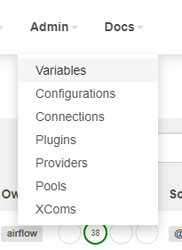

# Variable과 친해지기
[Variables](https://airflow.apache.org/docs/apache-airflow/stable/concepts/variables.html)


## Variable
 - Variable은 airflow의 runtime 중에 불러올 수 있는 변수들이다.
 - Key-Value 형식으로 세팅하고, 불러올 수 있다.
 - Value는 string형식으로 제한되어 있으나, 
 - UI/Airflow CLI/Environment variable/DAG file 안에서 세팅 등 다양한 방법이 있다.


## Variable setting하기
### UI로 setting하기


Main화면에서 admin-variable 클릭!


Variable 메뉴에서 *+ 아이콘* 체크 or `choose file`로 JSON을 이용해 여러 variable 등록!


Setting 하기!


### CLI로 세팅하기
```bash
airflow variables -s <variable_key> <value>
```


### Environment variable로 세팅하기
 - AIRFLOW_VAR_{VARIABLE_NAME} 으로 세팅할 수 있다.
 - `AIRFLOW_VAR_` 부분은 무시된 채로, VARIABLE_NAME 만 key로 설정된다. 이때, **모든 case는 lower된다!**
 - 아래의 예제에서, variable key는 `foo_baz`이다.
    ```bash
    export AIRFLOW_VAR_FOO_BAZ='{"hello":"world"}'
    ```


### DAG 안에서 세팅하기
```python
Variable.set(key='hello', value='Anita Darling')
```


### Variable 불러오기
```python
va = Variable.get('test')
print(va, type(va))
```


### 자동으로 UI/Log에서 숨김처리(***)되는 키워드들
 - 다음의 키들의 이름으로 세팅시, 값이 자동으로 ***로 마스킹된다.
    - password
    - secret
    - passwd
    - authorization
    - api_key
    - apikey
    - access_token
 - 이것은 단순히 UI/Log에서 sensitive한 value가 보이지 않게 해주는 기능이다!(cosmetic) 암호화와는 상관없다.
 - 앞의 키들은, Password, PassWord등도 먹히며(Case Sensitive X)
 - 앞이나 뒤에 무엇이 붙어도 상관없다. 즉, 해당 키워드가 key 안에 존재하기만 하면 마스킹이 트리거 된다. (a_password도 마스킹 됨)
 - 만약 다른 키를 마스킹 규칙에 추가하고 싶다면 airflow.cfg에서 `sensitive_var_conn_names`를 세팅하면 된다!(키 마다 comma로 separate)
    ```bash
    sensitive_var_conn_names = hello_world,my_not_pass_word
    ```


### Variable 암호화 - Fenet
 - Variable과 connection은 Fernet을 통해서 암호화 된다.
 - Airflow 1.9 이후 default로 Fernet으로 암호화 된다고 한다.(docker-compose로 실행시 왜인지 잘 되지 않는다...)
 - 키를 생성하기 위해서는 다음을 실행하면 된다.
    ```python
    from cryptography.fernet import Fernet

    fernet_key = Fernet.generate_key()
    print(fernet_key.decode())
    ```
 - print를 통해 나온 키를 등록해 주면 된다.
    - airflow.cfg를 통한 등록:
    ```bash
    # Secret key to save connection passwords in the db
    fernet_key = ZylSsQfaASdEl3RRA4omacsPOs2qwANeAO47Yum6sIs=
    ```

    - Environment Variable를 통한 등록:
    ```bash
    export AIRFLOW__CORE__FERNET_KEY=your_fernet_key
    ```
    참고- 환경변수에 지정된 값의 우선 순위가 airflow.cfg보다 높다!


