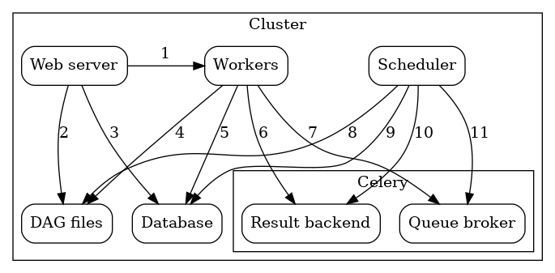

# How Celery Executor work across multiple machines
Celery Executor가 멀티 머신 환경에서 Airflow 태스크를 어떻게 실행하는 지, 그리고 설정 방법을 간단하게 훑어 보려고 한다.

## Airflow Celery Executor Architecture
멀티 머신 클러스터에서 Celery Executor를 구성하고 있는 아키텍쳐를 살펴보면 아래와 같다 


### About the Components
* Workers: 할당 된 태스크를 수행한다.
* Scheduler: 큐에 수행시켜야 하는 태스크들을 추가한다.
* Web server: DAG와 Task의 상태 정보를 보여주는 HTTP 서버
* Database: Tasks, DAGs, Variables, Connections 등의 정보를 보관하는 메타 스토어
* Celery: 큐 메커니즘
    * Broker: 수행할 커맨드들을 가지고 있음
    * Result Backend: 완료된 커맨드들의 상태를 보관

### Interactions between the components
* [1]: Web server <-- Workers : Task 수행 로그를 가져온다
* [2]: Web server <-- DAG files: DAG 구조를 파악한다
* [3]: Web server <-- Database: Task의 상태를 가져온다
* [4]: Workers <-- DAG files: DAG의 구조를 파악하고 태스크를 수행한다
* [5]: Workers <--> Database: Connection 설정, Variables, XCOM 등의 정보를 저장하고 가져온다.
* [6]: Workers --> Celery's Result Backend: Task의 상태를 저장한다
* [7]: Workers <-- Celery's Broker: 수행할 커맨드를 저장한다
* [8]: Scheduler <-- DAG files: DAG 구조를 파악하고 태스크를 수행한다
* [9]: Scheduler --> Database: DAG 수행과 관련 태스크들에 대한 정보를 저장한다.
* [10]: Scheduler <-- Celery's Result Backend: 수행 완료된 태스크에 대한 정보를 가져온다.
* [11]: Scheduler --> Celery's Broker: 수행 될 커맨드들을 넣는다

### Overall Workflow on scheduling task to Celery Executor worker
1. Scheduler에서 수행할 태스크를 찾으면 Broker에 전달한다
2. Scheduler는 Result Backend를 주기적으로 쿼리하여 완료 된 태스크들의 상태를 가져온다.
3. Broker는 Scheduler로부터 태스크에 대한 정보를 받으면 Worker 중 하나에 보낸다.
4. Worker는 태스크 커맨드를 수행하고, 수행이 완료되면 상태 정보를 Result Backend에 저장한다.


## How to use Celery Executor in Multi-machine environment
### Prerequisites
* Celery Backend에 사용될 메세지 브로커 설치 및 deploy (e.g., RabbitMQ, Redis).
* 모든 머신에 Airflow가 정상적으로 설치되어 있어야 한다.
* Airflow configuration은 모든 머신들이 동일하게 설정되어야 한다.
    * DAG 디렉토리, DB URL, 등등..
* **DAG 디렉토리에 모든 머신이 접근할 수 있어야 한다.**
    * 책에서도 나와있듯 NFS나 클라우드 스토리지가 권장된다.


### Setup
1. `airflow.cfg`에 Executor 설정을 CeleryExecutor로 변경하고, CeleryExecutor에 필요한 configuration을 설정한다.
- 사실 이 부분이 제일 tricky한 부분인데 실제 deploy 상황에 따라서 configuration이 달라질 거 같다..
- docker-compose로 설정하는 방법은 [여기](https://stackoverflow.com/questions/68194327/how-to-configure-celery-worker-on-distributed-airflow-architecture-using-docker/68198920#68198920)를 참고.
2. 메인 노드에는 scheduler, webserver를 띄우고, 워커로만 사용할 노드에는 celery worker를 프로세스를 띄워준다.
```bash
# Start Celery Worker
airflow celery worker

# Stop Celery Worker
airflow celery stop
```

### Run task on specific worker using queue
워커 프로세스를 띄울 때, `-q` 옵션을 이용해 큐를 지정해줄 수 있다.
```bash
airflow worker -q my_queue
```
그리고 task를 정의할 때도 queue 파라미터에 해당 워커의 큐 이름을 넘겨주면 된다.
```python
task = PythonOperator(
    task_id="task",
    python_callable=my_callable,
    queue="my_queue",
    dag=dag,
)
```

References:
* [Celery Executor Airflow official doc](https://airflow.apache.org/docs/apache-airflow/stable/executor/celery.html#architecture)
* [Celery worker in distributed environment using docker-compose](https://stackoverflow.com/questions/68194327/how-to-configure-celery-worker-on-distributed-airflow-architecture-using-docker/68198920#68198920)