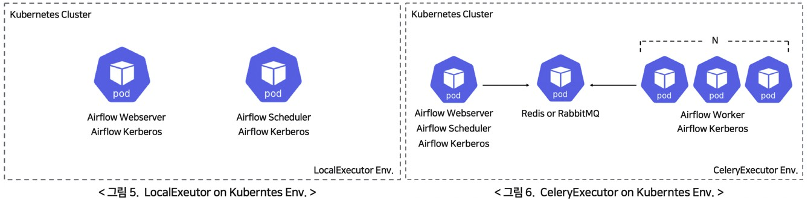
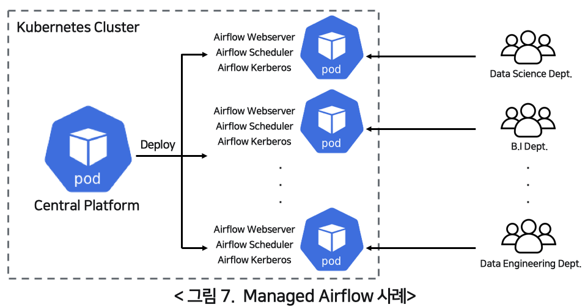
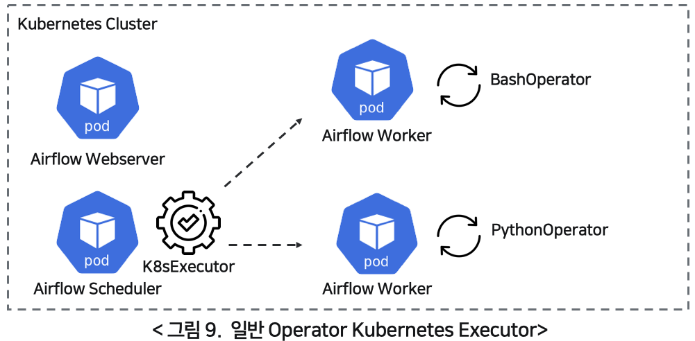
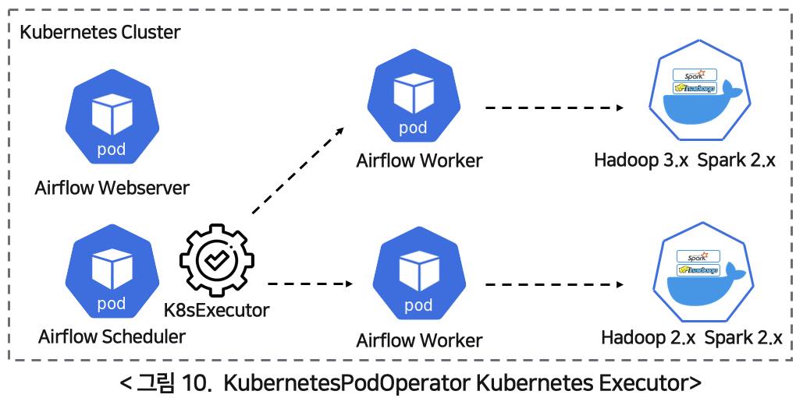

# Kubernetes X Airflow
Production에서 Airflow를 어떻게 사용하는지 찾아보니, 대부분의 회사에서 Airflow를 쿠버네티스와 함께 사용하고 있었다.
Celery executor도 선택지에 있었지만, 쿠버네티스의 유연함을 활용하지 못한다는 것과, 브로커를 위한 서비스를 추가로 띄우면서 관리 포인트가 늘어나는 것에 대한 걱정이 있었다.
결론적으로 쿠버네티스가 프로덕션에서는 가장 널리 쓰이고 유용하다는 것인데, Airflow와 쿠버네티스를 사용하는 두가지 방법에 대해 장단점을 비교한 [Line Financial](https://engineering.linecorp.com/ko/blog/data-engineering-with-airflow-k8s-2/)의 블로그 글이 있어서 참고해서 정리해봤다.

## 1. Airflow on Kubernetes

위 그림은 쿠버네티스 클러스터에 Airflow를 deploy하는 LocalExecutor와 CeleryExecutor의 예시이다.
기존에 프로세스 형태로 존재하던 컴포넌트들 (webserver, scheduler, etc.)이 Pod 단위로 실행되는 것이 전부이다.
Pod에 포함시킬 컴포넌트들은 자유롭게 환경에 따라 설정을 하면 된다.

### 장점
* 구성이 간단하고 템플릿화하기 쉽다.
* Managed Airflow 서비스를 개발하기 용이하다.

    * 각 조직마다 Pod 단위로 Airflow 서비스를 제공할 수 있다.
    * Airflow 서비스를 다양한 조직에 제공해야 할 때 유용하다.
    * 하지만 규모가 있는 조직에서만 사용될 가능성이 높다.
* 쿠버네티스 클러스터 차원에서 서비스를 지속적으로 유지시켜 준다.

### 단점
* Pod 단위로 서비스들을 유지하면서, 컴포넌트들이 쿠버네티스 클러스터에 지속적으로 상주한다.
    * 즉, 사용하지 않을 때도 자원을 계속 점유하게 되고 관리 포인트들이 유지된다.
* 컨테이너 확장성이 떨어진다.
    * 요구사항이 변경될 때마다 새로운 이미지를 만들어서 별도의 Airflow를 띄우거나 기존 Airflow에 dependency를 추가해야 한다 (유지보수 어려움).
    * 기존 Airflow에 dependency를 추가한다면, integration 차원에서 매우 많은 테스트를 거쳐야 한다..

## 2. Kubernetes Executor & KubernetesPodOperator
우선 K8S Executor의 동작은 오퍼레이터 종류에 따라서 두가지로 나뉜다.
오퍼레이터 종류는 일반적인 Operator (e.g., PythonOperator, BashOperator)이고, 다른 하나는 KubernetesPodOperator이다.

일반적인 operator를 사용하는 것에 대한 예시이다.
K8S Executor가 태스크 수행을 위해서 Airflow 워커를 Pod 형태로 실행한다.

KubernetesPodOperator 사용 시 동작 예시이다.
태스크 실행을 위해서 Airflow 워커를 Pod 형태로 실행하는 것은 동일하나, 워커 Pod에서 직접 정의한 컨테이너 이미지를 Pod 형태로 다시 실행한다는 차이점이 있다.
사용 방법은 책에도 꽤 자세히 나와있으니 생략하도록 한다.

### 장점
* Airflow 서비스를 위해서 라이브러리 의존성이 없는 기본 이미지를 사용해도 되기 때문에 매우 가볍다.
* 이미지 기반으로 운영하기 때문에 태스크 간 독립성이 보장되고 의존성 확인 등이 불필요하다. (유지 보수 비용 절감)
* 지속적으로 자원을 점유하는 방식이 아니라 실행 시에만 워커가 생성되고 완료 시 자원이 반납되기 때문에 효율적이다.

### 단점
* Worker Pod는 휘발성이라 태스트가 종료되면 Pod가 사라지고 로그가 유실된다. 따라서 로그를 유지하기 위해서 Cloud storage 등을 사용해야 하기 때문에 약간 번거롭다.

## 결론
결론적으로 많은 조직에서 K8S 기반으로 클러스터를 운영하고, Airflow를 사용하기 위해서 Kubernetes Executor와 KubernetesPodOperator를 사용하는 것 같다.
클러스터의 규모가 크고, 자원을 공유하는 조직들이 많다면 K8S 클러스터 구축이 많은 품이 들더라도 시도하는게 장기적으로 봤을 때 유용한 것 같다.
다만, 그렇지 않은 경우에는 Celery Executor를 사용하는 것이 대안일텐데, production에서 사용하는 예시가 많지 않기 때문에 어쩔 수 없이 시행착오를 겪으면서 보완해야 할 것으로 보인다.