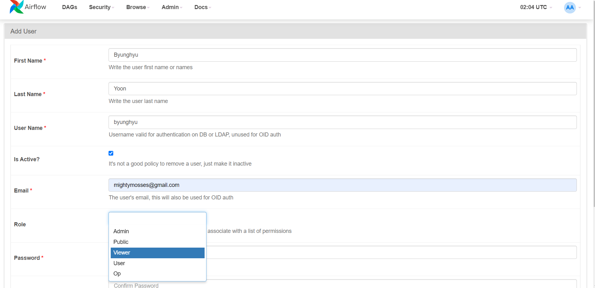
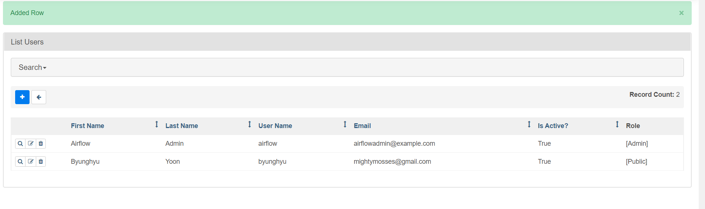

# Securing Airflow
이 챕터는 Airflow에 보안을 적용하는 다양한 방법들에 대해서 설명한다.

## Airflow 웹에 보안 적용하기

### RBAC(역할 기반 접근 제어)란?
 - Role-based access control.
 - 사전에 역할 그룹을 생성해두고, 거기에 permission의 부여한 후, 유저를 역할 그룹에 배정하는 방식의 보안 체계.
 - 많은 사람들이 속해있는 기관(회사)에서는 개인에게 다 다른 permission을 부여하는 것이 어렵기 때문에 RBAC를 많이 사용한다.
 - 역할 그룹에 따라, 웹에서 어떤 아이콘이 가시 유무, 태스크의 실행 유무를 지정할 수 있다

### 유저 추가하기
#### CLI
```python
airflow users create \
--role Admin # 속한 역할 그룹을 지정함\
--username byunghyu \
--password topsecret \
--email byunghyu@airflow.com \
--firstname Byunghyun \
--lastname Yoon
```

#### 웹을 이용해서 추가하기




### 역할과 permission(권한)
 - 현재 존재하는 역할과, 역할에 속한 권한은 Security > List Roles를 통해 확인할 수 있다.
 

 - 존재하는 웹 뷰와 각 permission의 관계는 Security > Permission on Views/Menus에서 확인할 수 있다.
 

## 물리 저장 데이터에 보안 적용
 - 서비스에 접근 가능한 entry point를 줄이자
 - entry point가 권한이 없는 모두가 접근할 수 있는 일은 피하도록 하자

### Fernet key를 이용한 데이터 보안
 - 이미 전의 discussion에서 다룬 내용이므로, 링크로 대체한다. [Fernet](../chapter11/variables.md)

## LDAP 서비스와 연동하기
 - 물론 airflow 웹에서 유저를 각각 추가하는 것이 가능하기는 하다.
 - 하지만, 이미 기관 내에서 유저 관리 시스템을 구현하고 있고, 많은 사람들이 airflow에 접근해야 한다면, airflow에 접속하는 모든 사람이 user를 생성해야하는 것은 불합리해 보인다. 기관 내의 유저 관리 시스템으로 airflow의 유저 관리를 대체할 수 있기 때문이다.

### LDAP(Lightweight Directory Access Protocol)란?
 - [LDAP 개념 잡기](https://yongho1037.tistory.com/796)

 - 네트워크 상에서 조직이나 개인정보 혹은 파일이나 디바이스 정보등을 찾아보는 것을 가능하게 만든 소프트웨어 프로토콜
 - DAP의 경량화 버전
 - data insert보다는 search에 용이
 - 데이터를 조금만 주고 받아도 되게끔 설계되어 있음
 - DB와 달리 transaction이나 rollback과 같은 insert 관련 기능이 부재하며, 복잡한 관계를 설정할 수 없고, 권장되지도 않는다.
 - 유저 권한과 같이 중앙에서 일괄 관리가 필요한 데이터들을 저장하고 검색하는데 좋음

## 웹서버에서 오고가는 트래픽 암호화
### Man-in-the-middle attach(MITM) 이란?
 - A지점에서 B지점으로 가는 데이터를 누군가가 낚아채어 데이터를 가져가고, 마치 아무런 일도 없었던 것처럼 B로 전송하는 기법. data가 암호화 되어있지 않다면, 거기에 속한 비밀번호, 개인정보 등이 탈취될 수 있다.
 - 책에서는 data가 탈취되더라도 영향을 완화할 수 있는 **HTTPS** 암호화 기술을 설명하고 있다.

### Airflow의 웹서버에 SSL 적용하여 HTTPS 활성화 하기
```bash
$ export AIRFLOW__WEBSERVER__WEB_SERVER_SSL_CERT={certificate path}
$ export AIRFLOW__WEBSERVER__WEB_SERVER_SSL_KEY={privatekey path n}
```

## Secret management system들에서 인증 불러오기
secret을 중앙화 시켜서 보관하는 시스템들을 이용하여 인증을 하는 방법에 대해 소개한다. 책에서는 vault를 이용하는 방식을 소개하지만, 우리는 높은 확률로 GCP를 사용할 것이다. 따라서, GCP를 이용한 방식을 소개한다. [출처: airflow.apache.org](https://airflow.apache.org/docs/apache-airflow-providers-google/stable/secrets-backends/google-cloud-secret-manager-backend.html)

1. 사전 조건
    - 필요한 패키지 설치
    ```bash
    $ pip install apache-airflow[google]
    ```

    - (Google의 secret manager api 설정)[https://cloud.google.com/secret-manager/docs/configuring-secret-manager]

2. airflow의 secret backend 활성화 하기
    - airflow.cfg에서 secrets backend 설정
    ```bash
    [secrets]
    backend = airflow.providers.google.cloud.secrets.secret_manager.CloudSecretManagerBackend
    ```

3. backend를 위한 parameter 설정
```bash
[secrets]
backend = airflow.providers.google.cloud.secrets.secret_manager.CloudSecretManagerBackend
backend_kwargs = {"connections_prefix": "avante_connection", "variables_prefix": "avante_variable", "gcp_key_path": "{gcp_key_file_path}"}
```

4. connection과 variable 생성은 gcloud beta secrets를 통해 가능하다
```bash
$ echo "mysql://example.org" | gcloud beta secrets create \
    avante_connection-first-connection \
    --data-file=- \
    --replication-policy=automatic
Created version [1] of the secret [avante_connection-first-connection].
```

airflow에서는 이를 first-connection이라는 이름으로 불러올 수 있다.

```bash
$ airflow connections get first-connection
Id: null
Connection Id: first-connection
Connection Type: mysql
Host: example.org
Schema: ''
Login: null
Password: null
Port: null
Is Encrypted: null
Is Extra Encrypted: null
Extra: {}
URI: mysql://example.org
```

